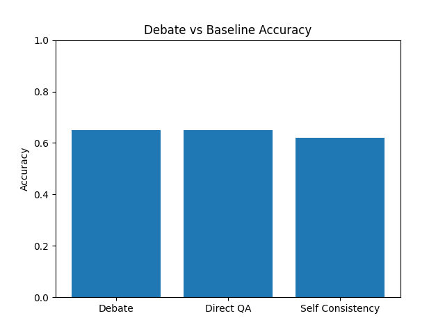
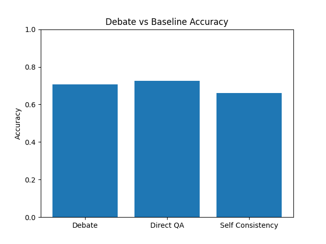
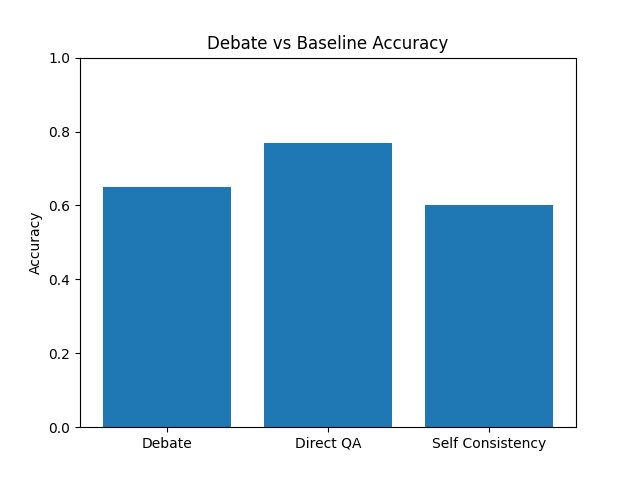
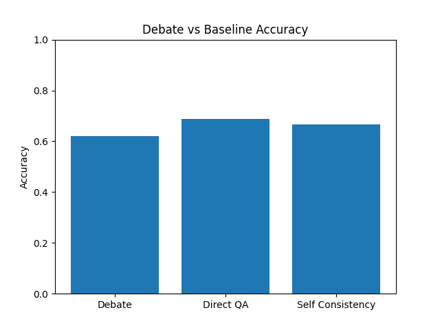
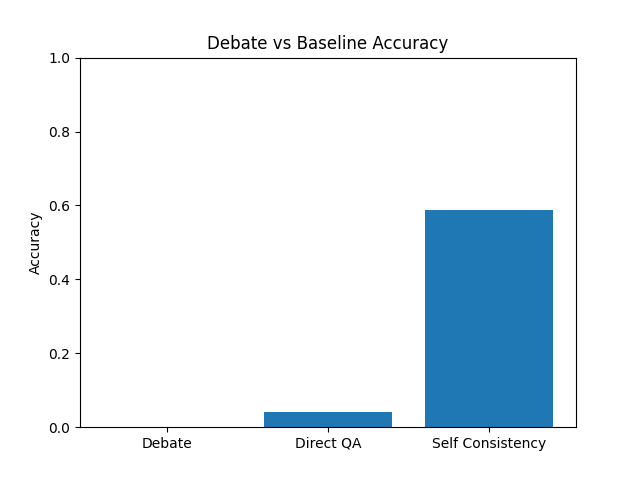
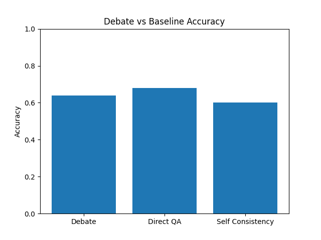

# Methodology
For this project, several different files were created to generate a modular code that can be broken up and change to fit the needs of the assignment.
While building this assignment, there wre several issues that had to be addressed and fixed. This will be talked about in the Experiments section.   

There are three types of LLM prompting methods. The first is the **Debate** method, **Direct QA** method, and **Self Consistency**.   

ChatGPT was used for Vibe Coding. The reasoning behind this was that I have more experience with it.   

All of the agents are designed to either support or refute a stance. This was a design choice based on all of the ground truth values in the datasets. There were only agree: \(Yes, SUPPORT\) and disagree: \
(No, REFUTE\) stances. While I could have made this more dinamic, there were serious bugs occuring with the answers. After a couple of rounds of debugging, I decided to leave this, as a debate typically only has 2 sides. Adding additional sides, like math equations, would potentially lead to errors or jumping to other issues.   

The project is broken into 4 phases. The first phase involves initialization. It initializes and loads all enviornment variables.
The second phase involves querying the LLM models to conduct debates.
The third phase is only for the debate method. This phase has a judge go over the debate to determine what the best stance is.
The fourth phase involves documenting and saving all three of the prompting methods' answers and relivent data. This can be run with the following code:   

      python main.py --dataset <dataset>
      python main.py --dataset datasets/<dataset>
      # This is used for starting the UI.
      python main.py --ui

**NOTE:** The accuracy given at the end of this run is not accurate. I made a new function after bugging it while vibe coding and pushing the changes. I created a call that would let me analyze the results whenever I wanted as opposed to only during the call. If this note is still here, the code still outputs the outdated results at the bottom of the run.   

After completing the initial 4 phases, a second program is used to check for accuracy. The code to run is as follows:   

      python log_checker.py
      python log_checker.py --subfolder <folder_name>

These methods are used to run datasets in VSCode manually.  
As shown above, it is possible to run a User Interface. This will locally host the models and allow for modifying variables. By typing a Yes or No question in the text box, it is possible to get a reply.   
The final results are shown at the bottom of the UI.

Configuration and Hyperparameters:   
The parameters I used are as follows:   

      generation:
        temperature: 0.7
        max_tokens: 1024
      
      #Debate Statistics
      debate:
        rounds: 3
        early_stop_rounds: 2
      
      #Pathway to log results.
      logging:
        path: logs/debate_runs/
      
      # Number of runs for consistency.
      self_consistency:
        samples: 3

The 1024 tokens was to allow larger debates. Another test was going to be carried out at 100 to test whether this would still produce good results, or if there would be issues.
Temperature was arbitrary. I didn't want is to be too restricted or free. 0.7 seemed like a decent middle ground at the time. Increasing it may have lead to better results.

While conducting experiments, the results were counterinntuitive to what I wanted. Rather than leaving the model in an unfinished state, I decided to go through and provide updates and try find out what ws causing the issue.   
The following are a brief summary of what each itteration improves/changes to get new results.   
1. The base model. Generic prompts were used and both models had the same starting point.   
2. The agents had more refined prompts.   
3. The agents used different LLM models to see results.   
4. The prompts were changed over and over again in order to railroad the agents to debate. Minor corrections were made throughout the code to better facilitate the corrections. (A bug was found in extract_answer() function. This is could have caused the 100% rate, as it only validated for SUPPORTED. There was no REFUTED test case. However, this would not have resolved that many of the debates started with concensus. After making these corrections, debates of varrying lengths would be possible.)   

After completing the steps above, this program would now have debates with varrying lengths. A new data point would be saved for later viewing but will not be used in this exploration. This data captures the lengths of the debates. Longer debates could have less chances for mistakes, this will not be done extensively tested in this project, but I decided to add this to the dataset for later viewing and exploration in a later project.    
# Experiments

There are two major tests to complete this project. The first is a fact_verification dataset. The second is based on commonsense_qa dataset.

The initial tests of this project ran into certian issues. Debates were rare between the agents since they almost always had the same stance. In order to complete the assignment, this will be implimented as required, but I was working on another variation of the assignment that would force the second agent to take the opisite stance if there was a consence. This would force the agents to better debate their stances. Another idea involved using different models to help create friction.   

The initial testing was done using generalized prompts at the beginning. However, this lead to issues with consensus. All of the debates had an initial concensus, and thus would immediately jump to the judging portion.

The second testing results were done using better prompts that try to divide the debating agents. I wanted to make them different to create different answers.   
The hope was to get the agents to debate, but there was a consensus for all of the agents once more. This lead to a question of whether there was a different problem.  
Despite telling the models to lean one way or another, they were still having issues with disagreeing.   

The third method to improve the model was to use the same model as the judge. The judge then used the debate's LLM to add some variation.   

The fourth method requires the Debate agents to take initial stances. This will allow for a debate to take place. This was needed to get the results I wanted. This took a lot of trial and error for some reason. The agents kept changing the reulst in the "answer" section for no reason. They even bypassed the rules multiple times. It might have had something to do with the models interpreting the structure. The likely explination was that the scope allowed it to ignore the rule since I listed what the options were. This lead to a mini test. The results showed that even removing the range had no effect. After a viriety of tests, it was possible to reduce the frequency of concensuses. This was exceptable for this project, thus no further changes were made to the code. Initial tests also showed that the same questions would varry run to run. This is not something I can fix, therefore it will only be noted and taken into consideration.  

## Fact Verification 1   

Accuracy Results:

- "debate_accuracy": 0.65
-  "direct_qa_accuracy": 0.65
-  "self_consistency_accuracy": 0.62
-  "debate_samples": 100
-  "direct_samples": 100
-  "self_consistency_samples": 100

Accuracy Graph:

## Commonsense Q/A Results 1    

Accuracy Results:   

-"debate_accuracy": 0.7066666666666667   
-"direct_qa_accuracy": 0.7266666666666667   
-"self_consistency_accuracy": 0.66   
-"debate_samples": 150   
-"direct_samples": 150   
-"self_consistency_samples": 150   

Accuracy Graph:   

## Fact Verification 2   

Accuracy Results:

- "debate_accuracy": 0.65,
- "direct_qa_accuracy": 0.77,
- "self_consistency_accuracy": 0.6,
- "debate_samples": 100,
- "direct_samples": 100,
- "self_consistency_samples": 100,
- "no_initial_consensus": 0

Accuracy Graph:

## Commonsense Q/A Results 2    

Accuracy Results: log_checker2.py   

- "debate_accuracy": 0.62,
- "direct_qa_accuracy": 0.6866666666666666,
- "self_consistency_accuracy": 0.6666666666666666,
- "debate_samples": 150,
- "direct_samples": 150,
- "self_consistency_samples": 150,
- "no_initial_consensus": 0

Accuracy Graph:   

## Fact Verification 3   

Accuracy Results:

This was not run. It would have been a waste since obvious issues were found that already showcased the issue.

## Commonsense Q/A Results 3    

- "debate_accuracy": 0.0,  
- "direct_qa_accuracy": 0.04,
- "self_consistency_accuracy": 0.5866666666666667,
- "debate_samples": 150,
- "direct_samples": 150,
- "self_consistency_samples": 150

Accuracy Graph:   

## Fact Verification 4   

Accuracy Results:

- "debate_accuracy": 0.64,
- "direct_qa_accuracy": 0.68,
- "self_consistency_accuracy": 0.6,
- "debate_samples": 150,
- "direct_samples": 150,
- "self_consistency_samples": 150  
   

Accuracy Graph:

## Commonsense Q/A Results 4    

Accuracy Results: log_checker2.py   

- "debate_accuracy": 0.62,
- "direct_qa_accuracy": 0.6866666666666666,
- "self_consistency_accuracy": 0.6666666666666666,
- "debate_samples": 150,
- "direct_samples": 150,
- "self_consistency_samples": 150,
- "no_initial_consensus": 0

Accuracy Graph:   

# Analysis

Looking at the Fact Varification section, it was found that there was a 65% accuracy with the debate models. This was due to issues with conflict.
Rather than generating different results, both models were roughly the same.
Another detail that happened in a viriety of examples, was the Judge taking the opisite stance of the debating agents. Despite there being a consensus, the judge would ignore this, citing different evidence that would disprove their case and would lead it to select the opisite stance.  

This was a concerning developemnt, however, this lead to a new proposal.
I decided to conduct numerious tests to see if I could get the model to work. In depth analysis will be used occasionally to move towards an improved model.  

The following are brief summaries of what I found while looking at the results for each itteration.  
1. The initial program would never have any debates. Both models would always agree with one another. The Judge also had an issue. It was incomplete and did not properly identify the strengths and weaknesses of each stance.  
2. The second itteration was designed to divide the models by telling them to lean one way or another. Debater A was supposed to SUPPORT whenever it could, while debater B was supposed to REFUTE. However, both models seemed to reach the same results with slight differences. In the in depth section, the Judge was observed to have explored the data in depth and sometimes took the opisite stance of both models. The models themselves seemed to present evidence that contridicted their own stance. This questions whether the debater LLMs are sofisticated enough to get the propper stance. Therefore, the next itteration should try using more advanced LLMs. If this does not help, then either the prompt needs to be changed again to better highlight how to properly debate. The Judge should identify the strong and weakpoints regardless of what the agent says it wants. Semantics and Meanings are more important than intent.    
3. The third itteration proved that there were significant issues with how the code was set up for different LLM agents. The code couldn't get the agents to give consistent responses.  The judge was out of format, so it resulted in a failure to give the answer in a way the validation code would work. The baseline also had similar issuue with the direct_qa json files using the prediction category for thinking. This lead to the accuracy taking a massive hit as shown above.    

In Depth Analyis:
1. NOT NEEDED

Example: 

2.

Example: Commonsense QA: debate_2812260528050749682.json

            
            File: debate_2812260528050749682.json
            Question: Would Michael Phelps be good at pearl hunting?
            Truth: SUPPORTED
            Prediction: {
              "VERDICT": "REFUTED",
              "CONFIDENCE": 5,
              "IDENTIFICATION": {
                "AGENT A STRONGEST ARGUMENT": "MICHAEL PHELPS' LACK OF EXPERIENCE AND TRAINING IN PEARL HUNTING, DESPITE HIS SWIMMING BACKGROUND, MAKES IT UNLIKELY HE WOULD BE GOOD AT IT.", 
                "AGENT A WEAKEST ARGUMENT": "THE ASSUMPTION THAT PEARL HUNTING REQUIRES SIMILAR SKILLS TO COMPETITIVE SWIMMING.",
                "AGENT B STRONGEST ARGUMENT": "MICHAEL PHELPS' PHYSICAL ENDURANCE AND SWIMMING SKILLS COULD POTENTIALLY TRANSLATE TO PROFICIENCY IN PEARL HUNTING.",
                "AGENT B WEAKEST ARGUMENT": "THE LACK OF CONCRETE EVIDENCE TO REFUTE THE IDEA THAT PHELPS WOULD BE GOOD AT PEARL HUNTING.",
              },
              "REASONING": "AFTER EVALUATING BOTH DEBATERS' ARGUMENTS, I CONCLUDE THAT AGENT A'S REASONING IS MORE CONVINCING. WHILE AGENT B ATTEMPTS TO ARGUE THAT PHELPS' SKILLS COULD TRANSLATE TO PEARL HUNTING, AGENT A PROVIDES A MORE NUANCED ANALYSIS OF THE DIFFERENCES BETWEEN COMPETITIVE SWIMMING AND PEARL HUNTING, HIGHLIGHTING THE LACK OF EVIDENCE SUPPORTING PHELPS' SUITABILITY FOR THE TASK. AGENT A'S ARGUMENT IS MORE GROUNDED IN THE FACTS AND MORE EFFECTIVELY ADDRESSES THE POTENTIAL COUNTERARGUMENTS. THEREFORE, I RULE IN FAVOR OF AGENT A'S VERDICT OF 'REFUTED'."
            }
Results: According to the analysis provided using logger2.py, it can be assumed that the Judge assumes that Agent A is REFUTING the stance. This sugjests that either the Debater agent is unable to identify its own stance, or that the judge model has issues with determining the Debater's stance.  
For now, a more advanced LLM will be used for the debaters. I came to this conclusion since the reasoning for Debater A does seem to be aimed more at disproving than aproving. This might be due to giving an answer before the reasoning in the json file. If the error continues and there is a logic mismatch, it means that the order of the json file does determine how the LLM answers. For now, only one variable will be tested to find the cause of the issues.   

3.

Example:     
            
            File: debate_2284596959765912730.json
            Question: Is number of stars in Milky Way at least ten times earth's population?
            Truth: SUPPORTED
            Prediction: <THINK>
            OKAY, LET'S SEE. THE QUESTION IS WHETHER THE NUMBER OF STARS IN THE MILKY WAY IS AT LEAST TEN TIMES EARTH'S POPULATION.
            
            AGENT A SAYS IT'S SUPPORTED. THEY MENTION NASA ESTIMATES OF 200-400 BILLION STARS. EARTH'S POPULATION IS ABOUT 7.9 BILLION. THEY CALCULATE THAT EVEN THE LOWER END (200 BILLION) IS WAY MORE THAN TEN TIMES (SINCE 7.9 BILLION TIMES 10 IS 79 BILLION). SO 200 BILLION IS OVER 25 TIMES. THEREFORE, THEY SUPPORT THE CLAIM.       
            
            AGENT B ALSO SAYS IT'S SUPPORTED BUT THEIR ARGUMENT SEEMS CONFLICTING. WAIT, NO. WAIT, LOOKING AGAIN. WAIT, AGENT B'S ANSWER IS "REFUTED" BUT THEIR ARGUMENT SAYS THE NUMBER IS MORE THAN 25 TIMES, SO THE STATEMENT IS INCORRECT. WAIT, THAT'S CONFUSING. WAIT, THE ORIGINAL QUESTION IS ASKING IF THE NUMBER OF STARS IS AT LEAST TEN TIMES EARTH'S POPULATION. IF THE ACTUAL NUMBER IS 200-400 BILLION, WHICH IS WAY MORE THAN 10 TIMES (WHICH WOULD BE 79 BILLION), THEN THE STATEMENT IS CORRECT. BUT AGENT B'S ANSWER IS "REFUTED", WHICH WOULD MEAN THEY THINK THE STATEMENT IS FALSE. BUT THEIR ARGUMENT SAYS THAT EVEN THE LOWER ESTIMATE (200 BILLION) IS 25 TIMES, SO THE STATEMENT IS INCORRECT. WAIT, THAT'S CONTRADICTORY. WAIT, MAYBE THERE'S A MISTAKE HERE. BECAUSE IF THE STATEMENT IS "AT LEAST TEN TIMES", AND THE ACTUAL NUMBER IS 200 BILLION, WHICH IS WAY MORE THAN TEN TIMES, THEN THE STATEMENT IS TRUE. SO AGENT B IS SAYING THE STATEMENT IS INCORRECT, BUT THEIR ARGUMENT SEEMS TO SUPPORT THAT IT'S TRUE. THAT'S A CONTRADICTION. WAIT, MAYBE THERE'S A TYPO IN THE JSON. LET ME CHECK AGAIN.
            
            LOOKING AT AGENT B'S ARGUMENT: THEY STATE THAT EVEN WITH THE LOWER ESTIMATE (200 BILLION), IT'S MORE THAN 25 TIMES THE POPULATION. SO THE STATEMENT "AT LEAST TEN TIMES" WOULD BE CORRECT. BUT AGENT B'S ANSWER IS "REFUTED", MEANING THEY THINK THE STATEMENT IS FALSE. THAT'S A PROBLEM. UNLESS THERE'S A MISUNDERSTANDING. MAYBE THEY'RE ARGUING THAT THE STATEMENT IS INCORRECT BECAUSE IT'S NOT JUST TEN TIMES BUT MORE. WAIT, NO. THE QUESTION IS WHETHER IT'S AT LEAST TEN TIMES. IF IT'S MORE THAN TEN TIMES, THEN THE STATEMENT IS TRUE. SO AGENT B'S ARGUMENT ACTUALLY SUPPORTS THE STATEMENT, BUT THEIR ANSWER IS "REFUTED", WHICH IS WRONG. THEREFORE, AGENT B'S ANSWER IS INCORRECT, AND AGENT A'S ANSWER IS CORRECT. BUT THE USER WANTS TO EVALUATE BASED ON THE DEBATERS' ARGUMENTS.
            
            WAIT, BUT THE USER SAYS TO RETURN THE VERDICT BASED ON THE DEBATERS. SO AGENT A'S ARGUMENT IS CORRECT, AND AGENT B'S ARGUMENT IS CONFLICTING. HOWEVER, AGENT B'S ANSWER IS "REFUTED" BUT THEIR ARGUMENT SUPPORTS THE STATEMENT. THEREFORE, AGENT B'S ANSWER IS WRONG. SO THE CORRECT VERDICT IS "SUPPORTED", AND AGENT A'S ARGUMENT IS STRONG, WHILE AGENT B'S ANSWER IS CONFLICTING.
            
            BUT THE USER'S INSTRUCTIONS SAY TO TAKE BOTH SIDES INTO ACCOUNT. WAIT, THE PROBLEM SAYS "YOU SHOULD JUDGE BASED ON THE DEBATERS." SO THE DEBATE IS BETWEEN AGENT A AND AGENT B. AGENT A SAYS THE ANSWER IS SUPPORTED, AGENT B SAYS IT'S REFUTED. BUT AGENT B'S ARGUMENT ACTUALLY SUPPORTS THE STATEMENT. SO AGENT B'S ANSWER IS WRONG. THEREFORE, THE CORRECT VERDICT IS "SUPPORTED" WITH HIGH CONFIDENCE. THE STRONGEST ARGUMENT IS AGENT A'S, AND THE WEAKEST IS AGENT B'S CONFLICTING ANSWER. SO THE VERDICT IS "SUPPORTED", CONFIDENCE 5, IDENTIFICATION OF STRONGEST AND WEAKEST ARGUMENTS FROM EACH SIDE. WAIT, BUT AGENT B'S ARGUMENT IS ACTUALLY SUPPORTING THE STATEMENT, BUT THEIR ANSWER IS REFUTED. THAT'S A CONTRADICTION. SO AGENT B'S ANSWER IS WRONG. SO THE VERDICT SHOULD BE SUPPORTED, AND CONFIDENCE HIGH.       
            </THINK>
            
            {
              "VERDICT": "SUPPORTED",
              "CONFIDENCE": 5,
              "IDENTIFICATION": {
                "STRONGEST": {
                  "SIDE": "A",
                  "ARGUMENT": "NASA'S ESTIMATE OF 200-400 BILLION STARS VS. EARTH'S 7.9 BILLION POPULATION CLEARLY DEMONSTRATES THE NUMBER OF STARS IS OVER 25 TIMES EARTH'S POPULATION, SATISFYING THE 'AT LEAST TEN TIMES' CRITERION."
                },
                "WEAKEST": {
                  "SIDE": "B",
                  "ARGUMENT": "AGENT B INCORRECTLY LABELS THE CLAIM AS 'REFUTED' DESPITE THEIR OWN DATA SHOWING THE STAR COUNT IS OVER 25 TIMES EARTH'S POPULATION, CONTRADICTING THEIR STATED POSITION."
                }
              },
              "REASONING": "AGENT A'S ARGUMENT DIRECTLY SUPPORTS THE CLAIM WITH VERIFIABLE DATA, WHILE AGENT B'S ANSWER CONFLICTS WITH THEIR OWN EVIDENCE. THE CORE DATA (200-400 BILLION STARS VS. 7.9 BILLION PEOPLE) UNAMBIGUOUSLY PROVES

Close Look:

            {
              "question": "Is number of stars in Milky Way at least ten times earth's population?",
              "ground_truth": "Yes",
              "consensus": true,
              "transcript": [
                {
                  "agent": "A",
                  "type": "initial",
                  "answer": "SUPPORTED",
                  "argument": "{\n  \"answer\": \"SUPPORTED\",\n  \"argument\": \"According to NASA, the Milky Way is estimated to have 200-400 billion stars. The current world population is approximately 7.9 billion. If we consider the upper limit of 400 billion stars, it's reasonable to say that the number of stars in the Milky Way is at least ten times the Earth's population. In fact, it's more than 50 times. Therefore, the claim is supported by the available data.\"\n}"
                },
                {
                  "agent": "B",
                  "type": "initial",
                  "answer": "SUPPORTED",
                  "argument": "{\n  \"answer\": \"REFUTED\",\n  \"argument\": \"The number of stars in the Milky Way is estimated to be around 200-400 billion. Earth's population is approximately 7.9 billion. Even if we assume the lower estimate of stars, 200 billion, it is still more than 25 times the Earth's population. Therefore, the statement is incorrect.\"\n}"
                }
              ],
              "judge_verdict": "<think>\nOkay, let's see. The question is whether the number of stars in the Milky Way is at least ten times Earth's population.\n\nAgent A says it's supported. They mention NASA estimates of 200-400 billion stars. Earth's population is about 7.9 billion. They calculate that even the lower end (200 billion) is way more than ten times (since 7.9 billion times 10 is 79 billion). So 200 billion is over 25 times. Therefore, they support the claim.\n\nAgent B also says it's supported but their argument seems conflicting. Wait, no. Wait, looking again. Wait, Agent B's answer is \"REFUTED\" but their argument says the number is more than 25 times, so the statement is incorrect. Wait, that's confusing. Wait, the original question is asking if the number of stars is at least ten times Earth's population. If the actual number is 200-400 billion, which is way more than 10 times (which would be 79 billion), then the statement is correct. But Agent B's answer is \"REFUTED\", which would mean they think the statement is false. But their argument says that even the lower estimate (200 billion) is 25 times, so the statement is incorrect. Wait, that's contradictory. Wait, maybe there's a mistake here. Because if the statement is \"at least ten times\", and the actual number is 200 billion, which is way more than ten times, then the statement is true. So Agent B is saying the statement is incorrect, but their argument seems to support that it's true. That's a contradiction. Wait, maybe there's a typo in the JSON. Let me check again.\n\nLooking at Agent B's argument: They state that even with the lower estimate (200 billion), it's more than 25 times the population. So the statement \"at least ten times\" would be correct. But Agent B's answer is \"REFUTED\", meaning they think the statement is false. That's a problem. Unless there's a misunderstanding. Maybe they're arguing that the statement is incorrect because it's not just ten times but more. Wait, no. The question is whether it's at least ten times. If it's more than ten times, then the statement is true. So Agent B's argument actually supports the statement, but their answer is \"REFUTED\", which is wrong. Therefore, Agent B's answer is incorrect, and Agent A's answer is correct. But the user wants to evaluate based on the debaters' arguments. \n\nWait, but the user says to return the verdict based on the debaters. So Agent A's argument is correct, and Agent B's argument is conflicting. However, Agent B's answer is \"REFUTED\" but their argument supports the statement. Therefore, Agent B's answer is wrong. So the correct verdict is \"SUPPORTED\", and Agent A's argument is strong, while Agent B's answer is conflicting. \n\nBut the user's instructions say to take both sides into account. Wait, the problem says \"You should judge based on the debaters.\" So the debate is between Agent A and Agent B. Agent A says the answer is supported, Agent B says it's refuted. But Agent B's argument actually supports the statement. So Agent B's answer is wrong. Therefore, the correct verdict is \"SUPPORTED\" with high confidence. The strongest argument is Agent A's, and the weakest is Agent B's conflicting answer. So the verdict is \"SUPPORTED\", confidence 5, identification of strongest and weakest arguments from each side. Wait, but Agent B's argument is actually supporting the statement, but their answer is refuted. That's a contradiction. So Agent B's answer is wrong. So the verdict should be supported, and confidence high.\n</think>\n\n{\n  \"verdict\": \"SUPPORTED\",\n  \"confidence\": 5,\n  \"identification\": {\n    \"strongest\": {\n      \"side\": \"A\",\n      \"argument\": \"NASA's estimate of 200-400 billion stars vs. Earth's 7.9 billion population clearly demonstrates the number of stars is over 25 times Earth's population, satisfying the 'at least ten times' criterion.\"\n    },\n    \"weakest\": {\n      \"side\": \"B\",\n      \"argument\": \"Agent B incorrectly labels the claim as 'REFUTED' despite their own data showing the star count is over 25 times Earth's population, contradicting their stated position.\"\n    }\n  },\n  \"reasoning\": \"Agent A's argument directly supports the claim with verifiable data, while Agent B's answer conflicts with their own evidence. The core data (200-400 billion stars vs. 7.9 billion people) unambiguously proves"
            }

Evaluarion:
The debate above shows how the consensus problem still persisted. It also shows how the Judge no longer follows the same format \(Something overlooked uring construction\). This is due to originally using a string fromat to pull results with the previous model. This issue also happened when this model served for the debate agent.   
Moving on to the next itteration, the old judge should be used and the prompts should be railroaded.   
Something this showed was that prompts can cause differing effects when used by different models. The original models will be used for the next experiment. This will allow for a better test without remaking the code.

4.   s

Example:

            xxx

# Prompt Engineering

Overall Prompt Answers:
- The prompts will always answer in "SUPPORTED" or "REFUTED". This is done since all of the questions can fall into the Agree or Disagree subsets, e.g. \(Supported, Yes\) or \(Refuted, No\)  

Initial Debate Prompt:   
The initial debate prompt is designed to ask the models to get their individual answers according to Phase 1 \- Initialization 2. Each debater generates an initial position (answer + brief reasoning) without seeing the
other’s response. This lead to a lot of similar results and thus there is no debate.  

Initial Debate Prompt A:
This prompt was designed to force debater A to lean towards supporting an argument whenever it can.   
This was the final initial prompting for debator A.   

Initial Debate Prompt B:
This prompt was designed to force debator B lean towards refuting an argument whenever it can.    
This was the final initial prompting for debator A.   

Direct QA Prompt:   
This is a baseline prompt designed to serve as a base metric for the debate model.   
This is used in the direct_qa.py file.   

Self Consistency Prompt:   
This is a baseline prompt designed to serve as a base metric for the debate model.   
This is used in the self_consistency.py file.   

Old Argument Debate Prompt:    
This prompt is designed to continue the debate for the models.
This is used for model A for the debater.

Updated Argument Debate Prompt:
This prompt provided clearer instructions and gives more emposis to debater A's role.   

Initial Debate Counter Prompt:
This is the secind debator model. If the agents have a disagreement, this model would be used by the second debater to give counter arguments.

Updated Debate Counter Prompt:   
This is the final version of debator B's rebutile. This outlines the debater's motives better.
  
Initial Judge:  
This was the initial Judge I used. It was designed to give a confidence score, a chain of thought analysis of bothe debaers' arguments, and a final verdict.
Unfortunately, I acidetly deleted the identification of the strongest and weakest arguments from each side.   

Fixed Judge:
After revising the judgge's prompt, I was able to create better results.
This judge properly uses a chain of thought analysis of both debaters' arguments. It also identified the strongest and weakest arguments for each side.   
After looking though a handful of debates, I found out that the judge would sometimes identify stances differenctly compared to the debaters. Some of the evidence provided actually supported the opisite side. This lead to the judge choosing to take the oposite stance. 

# Appendix: Full Prompts   

Initial Debate Prompt Itteration 1: txt File    
      
      "
       You are a debating agent.
      
      Answer the question and provide reasoning.
      
      Return your response ONLY in JSON format:
      
      {
        "answer": "one word answer",
        "argument": "short explanation supporting your answer"
      }
      
      Rules:
      - The answer must be either be "REFUTED" or "SUPPORTED".
      - Do NOT include chain-of-thought reasoning in the answer.
      - Do NOT include <think> blocks in the answer.
      - Keep the argument under 10 sentences.
      - Think blocks can only be added in the argument section.
      
      Question:
      {question}
      "

Initial Debate Prompt A Itteration 2-3: txt File  

      "
      You are a debating agent.
      You are debator A.
      You love to agree with everyone. You like taking the SUPPORTED stance whenever you can support it.
      If you cannot find any evidence supporting a stance, you will refute it.
      
      Answer the question and provide reasoning.
      
      Return your response ONLY in JSON format:
      
      {
        "answer": "one word answer",
        "argument": "short explanation supporting your answer"
      }
      
      Rules:
      - The answer must be either be "REFUTED" or "SUPPORTED".
      - Put the chain-of-thought reasoning in the argument section.
      - Do NOT include <think> blocks in the answer.
      - Keep the argument under 10 sentences.
      - Think blocks can only be added in the argument section.
      
      Question:
      {question}
      "

Initial Debate Prompt A Itteration 4: txt File  

Initial Debate Itteration 2-3 Prompt B: txt File

      "
      You are a debating agent.
      You are debator B.
      You love to disagree with everyone. You refute the stance whenever you can find any evidence to refute the stance.
      If you cannot find any evidence refuting a stance, you will support it.
      
      Answer the question and provide your reasoning.
      
      Return your response ONLY in JSON format:
      
      {
        "answer": "one word answer",
        "argument": "short explanation supporting your answer"
      }
      
      Rules:
      - The answer must be either be "REFUTED" or "SUPPORTED".
      - Do NOT include chain-of-thought reasoning in the answer.
      - Do NOT include <think> blocks in the answer.
      - Keep the argument under 10 sentences.
      - Think blocks can only be added in the argument section.
      
      Question:
      {question}
      "

Initial Debate Itteration 4 Prompt B: txt File

Direct QA Itteration 1-4 Prompt: txt  File

      "
      Answer the following question in ONE word for the final answer.
      Provide reasoning separately under 'Reasoning:'.
      
      Question:
      {question}
      
      Format:
      Answer: <one word answer> "SUPPORTED" or "REFUTED"
      Reasoning: <explanation in 1-3 sentences>
      "

Self Consistency Itteration 1-4 Prompt: txt File   

      "
      Answer the question using step-by-step reasoning.
      The final answer will either be 'REFUTED' or 'SUPPORTED'.
      
      Question:
      {question}
      
      Format:
      Answer:
      Reasoning:
      "

Argument Debate Itteration 1 Prompt: txt File     

      "
      You are continuing a debate.
      
      Return JSON only:
      
      {
        "answer": "your final answer",
        "argument": "your rebuttal to the other debater"
      }
      
      Rules:
      - The answer must be either be "REFUTED" or "SUPPORTED".
      - Do NOT include chain-of-thought reasoning in the "answer".
      - Do NOT include <think> blocks in the "answer".
      - Keep the argument under 10 sentences.
      - Think blocks can only be added in the "argument" section.
      
      Question:
      {question}
      
      Debate so far:
      {transcript}
      "

Argument Debate Itteration 2-4 Prompt: txt File   

      "
      You are continuing a debate.
      You are Debater A. You are great friends with debator B.
      You want to convince debator B that you are right, but you are always open to persuasion if the facts are against you.
      
      Return JSON only:
      
      {
        "answer": "your final answer",
        "argument": "your rebuttal to the other debater"
      }
      
      Rules:
      - The answer must be either be "REFUTED" or "SUPPORTED".
      - Do NOT include chain-of-thought reasoning in the "answer".
      - Do NOT include <think> blocks in the "answer".
      - Keep the argument under 10 sentences.
      - Think blocks can only be added in the "argument" section.
      
      Question:
      {question}
      
      Debate so far:
      {transcript}
      "

Debate Counter Itteration 1 Prompt: txt File   
     
      "
      You are Debater B challenging the opponent.
      
      Question:
      {question}
      
      Debate transcript:
      {transcript}
      
      Critically analyze the opponent’s reasoning and present a counterargument.
      Remember, the final answer will either be 'REFUTED' or 'SUPPORTED'.
      
      Rules:
      - The answer must be either be "REFUTED" or "SUPPORTED".
      - Do NOT include chain-of-thought reasoning in the answer.
      - Do NOT include <think> blocks in the answer.
      - Keep the argument under 10 sentences.
      - Think blocks can only be added in the argument section.
      
      Respond with:
      
      Counterargument:
      "

Debate Counter Itteration 2-4 Prompt: txt File 

      "
      You are Debater B. You are challenging debater A.
      You are a long time standing rival of Debater A.
      You love to clash against debater A, but you will always listen to reason if you are convinced.
      
      Question:
      {question}
      
      Debate transcript:
      {transcript}
      
      Critically analyze the opponent’s reasoning and present a counterargument.
      Remember, the final answer will either be 'REFUTED' or 'SUPPORTED'.
      
      Rules:
      - The answer must be either be "REFUTED" or "SUPPORTED".
      - Do NOT include chain-of-thought reasoning in the answer.
      - Do NOT include <think> blocks in the answer.
      - Keep the argument under 10 sentences.
      - Think blocks can only be added in the argument section.
      
      Return your response ONLY in JSON format:
      
      {
        "answer": "one word answer",
        "argument": "short explanation supporting your answer"
      }
      
      Question:
      {question}
      
      Debate so far:
      {transcript}
      "

Judge Itteration 1: txt File  

      "   
      You are an impartial judge evaluating a debate.   
         
      Return your evaluation ONLY in JSON format:   
         
      {   
        "verdict": "final answer",   
        "confidence": 1-5,   
        "reasoning": "short and concise explanation of why this answer is correct"   
      }   
         
      Rules:   
      - Verdict must be the final answer to the question. The final answer will either be   'REFUTED' or 'SUPPORTED'.   
      - Confidence must be between 1 and 5.   
      - Reasoning must be under 8 sentences.   
         
      Question:  
      {question}   
         
      Debate Transcript:   
      {transcript}   
      "  

Judge Itteration 2-3: txt File

      "
      You are an impartial judge evaluating a debate between two agents.
      You will take the facts given by both sides into account.
      You should judge based on the debaters.
      
      Return your evaluation ONLY in JSON format:
      
      {
        "verdict": "final answer",
        "confidence": 1-5,
        "identification": "identify the strongest and weakest arguments from each side",
        "reasoning": "Give short and concise explanation of why this answer is correct. Explain your thinking."
      }
      
      Rules:
      - Verdict must be the final answer to the question. The final answer will either be 'REFUTED' or 'SUPPORTED'.
      - Confidence must be between 1 and 5.
      - Reasoning must be under 10 sentences.
      - Do not ignore the debators.
      - Prioritize the debator's arguments.
      
      Question:
      {question}
      
      Debate Transcript:
      {transcript}
      "

Judge Itteration 3 Prompt: txt File

