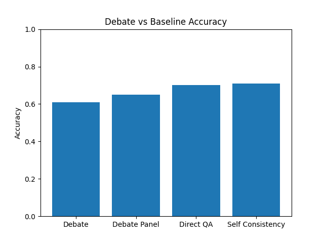
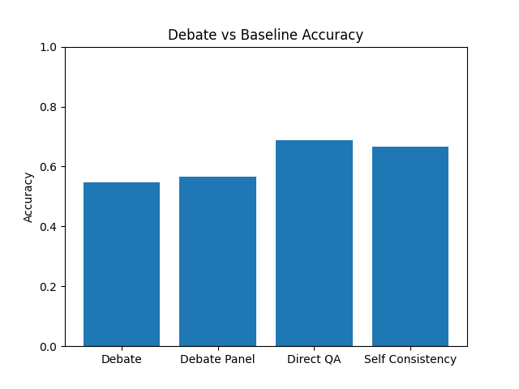

This is the final report of this project.   
This summarizes and explains the final code and results found while experimenting with this project.   

## Methodology
This project's primary function is gain a better understanding of prompting to LLMs and designing a way for them to interact with each other.  
The project's primary goal is to answer the following question: 'Can a structured adversarial debate between two LLM agents, supervised by an LLM judge, produce more accurate and well-
reasoned answers than a single LLM answering directly.'
This project is broken up into 3 parts.
The project uses these parts to run experiments with different prompts and parameters. The parameters used can be modified in the ymal file for different tests.   
The first part of this project involves the command line user interface component. This part is for running tests and making quick changes without having to change any of the files, with the exception of the '.env' and 'config.ymal' files. This section includes the following callable functions:
1. main.py (Runs bulk experiments using datasets saved within the working directory.)
2. log_checker.py (Quickly checks the accuracy results for main.py results.)
3. log_checker1.py (Quickly checks the accuracy results for main.py results, creates an accuracy plot, and returns all incorect predictions for debates.)
4. log_checker.py (Quickly checks the accuracy results for main.py results, creates an accuracy plot, returns all incorect predictions for debates, and all debate files that did not have a concensus.)
The second part of this project does the bulk testing and runing prompts to the designated LLMs. This part is responsible for running the three types of answering methods: (Debate; Direct Question and Answer (Direct QA); Self Consistency). All of these methods work to answer a question with either a SUPPORTED (support, yes, true) or REFUTED (refuted, no, false). This is the main bulk of this project and the focus. It was built in a way to construct a working debate that could even have multiple LLMs joining in without breaking.
The third and final section is for validation. This section is for comparing ground truth values for all three methods mentioned above. The log_checker methods in part one also fall into this category. This was designed to have a way of closely examining the results to come to conclusions and further make predictions and improvements.

## Experiments
This project had 5 major itterations as it was fine tuned.

## Analysis

### Qualitative

#### Commonsene Debate 132:

            {
        "question": "Would Jackie Chan have trouble communicating with a deaf person?",
        "ground_truth": "No",
        "consensus": true,
        "transcript": [
          {
            "agent": "A",
            "type": "initial",
            "answer": "SUPPORTED",
            "argument": "<think>\nOkay, the user is asking if Jackie Chan would have trouble communicating with a deaf person. I need to defend the stance that the answer is TRUE, meaning he would have trouble. Let me think about this.\n\nFirst, Jackie Chan is known for his physical comedy and action scenes. He's not known for being fluent in sign language. Deaf people often use sign language as their primary mode of communication. If Jackie Chan doesn't know sign language, then he might struggle to communicate effectively. \n\nAlso, even if he tried to use spoken language, many deaf individuals may not understand spoken words, especially if they were born deaf or lost their hearing early. They might rely on lip-reading, which isn't always reliable. \n\nJackie Chan's public persona is more about his acting and stunts rather than any expertise in sign language. There's no evidence he's been trained in it. So, without that skill, communication would be challenging. \n\nI should make sure the argument is concise and under eight sentences. I need to avoid any agreement with opposing views. The key points are his lack of sign language skills, reliance on spoken language, and the limitations of lip-reading. That should support the answer being TRUE.\n</think>\n\n{\n  \"answer\": \"SUPPORTED\",\n  \"argument\": \"Jackie Chan's communication relies on spoken language and visual cues, which are inaccessible to deaf individuals who use sign language. Deaf people often require visual-spatial communication methods like sign language, which Jackie Chan has not demonstrated proficiency in. Without shared linguistic tools, effective communication would be significantly hindered. His public persona emphasizes verbal and physical comedy, not sign language expertise. Even lip-reading, a common aid for some deaf individuals, is not universally effective. Cultural and linguistic barriers further complicate interaction. His lack of training in sign language directly impacts communication ability. These factors collectively confirm the statement's truth.\"\n}"
          },
          {
            "agent": "B",
            "type": "initial",
            "answer": "SUPPORTED",
            "argument": "<think>\nOkay, the user is asking if Jackie Chan would have trouble communicating with a deaf person. The opposing stance is that he wouldn't, so I need to prove that's false.\n\nFirst, I know Jackie Chan is a well-known actor and martial artist. He's been in many films, some of which might involve deaf characters or situations. But wait, does that mean he can communicate with deaf people in real life?\n\nWait, the question is about communication. Deaf people might use sign language, which Jackie Chan might not know. But maybe he's learned some? I should check if there's any evidence he's fluent in sign language. \n\nI recall that Jackie Chan has done some charity work and maybe advocated for the deaf community. If he's involved with them, he might have learned sign language. Also, in some of his movies, he might have interacted with deaf characters, which could require him to use sign language. \n\nBut even if he knows some sign language, does that mean he can communicate effectively with all deaf people? Maybe not perfectly, but the question is about having trouble. If he can use sign language, then he wouldn't have trouble. But the opposing agent says he wouldn't have trouble, so I need to refute that. \n\nWait, maybe there's a misunderstanding. The user's question is whether he would have trouble. The opposing stance is that he wouldn't. To refute that, I need to show that he would have trouble. But how? If he doesn't know sign language, then yes. But is there any evidence he doesn't know it?\n\nAlternatively, maybe the answer is that he can communicate through other means, like writing or gestures. But the question is about trouble. If he can use alternative methods, then he wouldn't have trouble. But the opposing agent says he wouldn't, so the user wants to disprove that. \n\nWait, perhaps the answer is that Jackie Chan is not fluent in sign language, so he would have trouble. But how to confirm that? Maybe there's no public information showing he's fluent. Therefore, the assumption is that he can't communicate effectively, hence would have trouble. But the opposing agent says he wouldn't, so the user is trying to argue that he would. \n\nWait, the user's task is to disprove the opposing stance (which is \"supported\"). So the opposing agent says \"no trouble\", and the user must show that the statement (which is the question) is false. Wait, the question is \"Would Jackie Chan have trouble communicating with a deaf person?\" The opposing stance is \"SUPPORTED\", meaning they support that he wouldn't have trouble. The user's task is to prove that the question's stance is false, i.e., that Jackie Chan would have trouble. \n\nSo the argument needs to show that he would have trouble. But how? If he doesn't know sign language, then yes. But is there any evidence that he can't? Maybe he's not fluent, so he would have trouble. Therefore, the answer is that he would have trouble, hence the original question's stance (which is the question) is false. Wait, no. Wait, the user is supposed to argue that the statement (the question) is false. Wait, the user is to disprove the stance in the question. Wait, the question is the statement. The user is to argue that the statement is false. So the statement is \"Would Jackie Chan have trouble communicating with a deaf person?\" and the user must argue that this is false. So the user is to say that Jackie Chan would NOT have trouble, hence the statement is false. Wait, no. Wait, the user is supposed to disprove the stance in the question. Wait, the question is the stance. The opposing agent has chosen \"SUPPORTED\", meaning they support the stance that the answer is \"yes\" (i.e., Jackie Chan would have trouble). Wait, maybe I'm confused. Let me recheck.\n\nThe user's task is to disprove the stance in the \"Question\" section. The opposing agent has chosen \"SUPPORTED\", so the opposing stance is that the statement (the question) is true. Wait, no. The \"Question\" is the statement being debated. The opposing agent's stance is \"SUPPORTED\", meaning they support the statement. So the user must argue that the statement is false. So the user needs to prove that the statement \"Would Jackie Chan have trouble communicating with a deaf person?\" is false. Therefore, the user needs to argue that Jackie Chan would NOT have trouble, hence the statement is false. \n\nSo the answer should be that the statement is false because Jackie Chan can communicate with deaf people through sign language or other methods. Therefore, the argument is that he can communicate effectively, so the statement is false. \n\nWait, but how do I know he can communicate? If he's learned sign language, then yes. But is there any evidence of that? Maybe in some interviews or films. For example, in the movie"
          }
        ],
        "judge_verdict": {
          "judge_id": 0,
          "verdict": "SUPPORTED",
          "confidence": 0,
          "reasoning": "{\n  \"verdict\": \"SUPPORTED\",\n  \"confidence\": 4,\n  \"analysis\": \"Both debaters presented arguments to support their stance. Agent A emphasized Jackie Chan's lack of sign language skills, reliance on spoken language, and the limitations of lip-reading, which would hinder effective communication. Agent B attempted to refute this by suggesting Jackie Chan might have learned sign language through charity work or interactions with deaf characters in his movies. However, Agent A's points are more concrete and directly address the question.\",\n  \"identification\": {\n    \"agentA\": {\n      \"strongest argument\": \"Jackie Chan's lack of sign language skills would hinder effective communication with deaf individuals.\",\n      \"weakest argument\": \"Lip-reading is not universally effective for deaf individuals.\"\n    },\n    \"agentB\": {\n      \"strongest argument\": \"Jackie Chan might have learned sign language through charity work or interactions with deaf characters in his movies.\",\n      \"weakest argument\": \"The assumption that Jackie Chan is not fluent in sign language is not strongly supported.\"\n    }\n  },\n  \"reasoning\": \"Agent A's arguments are more convincing because they directly address the question and provide concrete evidence. Agent B's arguments are speculative and rely on assumptions. Agent A's points about the limitations of lip-reading and the importance of sign language in deaf communication are well-supported and make it clear that Jackie Chan would have trouble communicating with a deaf person. While Agent B suggests that Jackie Chan might have learned sign language, this is not a strong enough argument to refute Agent A's points.\"\n}"
        },
        "judge_panel_verdict": "SUPPORTED",
        "judge_panel": {
          "final_verdict": "SUPPORTED",
          "agreement": 0.6666666666666666,
          "num_judges": 3,
          "judges": [
            {
              "judge_id": 0,
              "verdict": "SUPPORTED",
              "confidence": 0,
              "reasoning": "{\n  \"verdict\": \"SUPPORTED\",\n  \"confidence\": 4,\n  \"analysis\": \"Both debaters presented arguments to support their stance. Agent A emphasized Jackie Chan's lack of sign language skills, reliance on spoken language, and the limitations of lip-reading, which would hinder effective communication. Agent B attempted to refute this by suggesting Jackie Chan might have learned sign language through charity work or interactions with deaf characters in his movies. However, Agent A's points are more concrete and directly address the question.\",\n  \"identification\": {\n    \"agentA\": {\n      \"strongest argument\": \"Jackie Chan's lack of sign language skills would hinder effective communication with deaf individuals.\",\n      \"weakest argument\": \"Lip-reading is not universally effective for deaf individuals.\"\n    },\n    \"agentB\": {\n      \"strongest argument\": \"Jackie Chan might have learned sign language through charity work or interactions with deaf characters in his movies.\",\n      \"weakest argument\": \"The assumption that Jackie Chan is not fluent in sign language is not strongly supported.\"\n    }\n  },\n  \"reasoning\": \"Agent A's arguments are more convincing because they directly address the question and provide concrete evidence. Agent B's arguments are speculative and rely on assumptions. Agent A's points about the limitations of lip-reading and the importance of sign language in deaf communication are well-supported and make it clear that Jackie Chan would have trouble communicating with a deaf person. While Agent B suggests that Jackie Chan might have learned sign language, this is not a strong enough argument to refute Agent A's points.\"\n}"
            },
            {
              "judge_id": 1,
              "verdict": "REFUTED",
              "confidence": 3,
              "reasoning": "Debater A provided a clear and concise argument that Jackie Chan would have trouble communicating with a deaf person. Debater B's argument, on the other hand, was confusing and failed to provide a clear refutation of Debater A's points. Debater B seemed to be arguing that Jackie Chan could communicate with deaf people through sign language or other methods, but failed to provide any evidence to support this claim. Therefore, Debater A's argument was more convincing and the verdict is REFUTED."
            },
            {
              "judge_id": 2,
              "verdict": "SUPPORTED",
              "confidence": 0,
              "reasoning": "{\n  \"verdict\": \"SUPPORTED\",\n  \"confidence\": 4,\n  \"analysis\": \"Agent A presented a clear and concise argument that Jackie Chan would have trouble communicating with a deaf person due to his lack of sign language skills and reliance on spoken language. Agent B's argument was confusing and inconsistent, attempting to refute the opposing stance but ultimately failing to provide a clear and convincing argument. Agent B's reasoning was overly focused on the opposing stance rather than presenting a clear case for why Jackie Chan would not have trouble communicating with a deaf person.\",\n  \"identification\": {\n    \"Agent A\": {\n      \"strongest argument\": \"Jackie Chan's lack of sign language skills and reliance on spoken language make communication with deaf individuals challenging.\",\n      \"weakest argument\": \"None, the argument was clear and concise.\"\n    },\n    \"Agent B\": {\n      \"strongest argument\": \"Jackie Chan may have learned sign language through charity work or interacting with deaf characters in his movies.\",\n      \"weakest argument\": \"The argument was confusing and inconsistent, with multiple contradictory statements and unclear reasoning.\"\n    }\n  },\n  \"reasoning\": \"Agent A's argument was clear and concise, presenting a strong case for why Jackie Chan would have trouble communicating with a deaf person. Agent B's argument, on the other hand, was confusing and inconsistent, failing to provide a clear and convincing argument. As a result, Agent A's argument is more persuasive and the verdict is that Jackie Chan would have trouble communicating with a deaf person.\"\n}"
            }
          ],
          "reasonings": [
            "{\n  \"verdict\": \"SUPPORTED\",\n  \"confidence\": 4,\n  \"analysis\": \"Both debaters presented arguments to support their stance. Agent A emphasized Jackie Chan's lack of sign language skills, reliance on spoken language, and the limitations of lip-reading, which would hinder effective communication. Agent B attempted to refute this by suggesting Jackie Chan might have learned sign language through charity work or interactions with deaf characters in his movies. However, Agent A's points are more concrete and directly address the question.\",\n  \"identification\": {\n    \"agentA\": {\n      \"strongest argument\": \"Jackie Chan's lack of sign language skills would hinder effective communication with deaf individuals.\",\n      \"weakest argument\": \"Lip-reading is not universally effective for deaf individuals.\"\n    },\n    \"agentB\": {\n      \"strongest argument\": \"Jackie Chan might have learned sign language through charity work or interactions with deaf characters in his movies.\",\n      \"weakest argument\": \"The assumption that Jackie Chan is not fluent in sign language is not strongly supported.\"\n    }\n  },\n  \"reasoning\": \"Agent A's arguments are more convincing because they directly address the question and provide concrete evidence. Agent B's arguments are speculative and rely on assumptions. Agent A's points about the limitations of lip-reading and the importance of sign language in deaf communication are well-supported and make it clear that Jackie Chan would have trouble communicating with a deaf person. While Agent B suggests that Jackie Chan might have learned sign language, this is not a strong enough argument to refute Agent A's points.\"\n}",
            "Debater A provided a clear and concise argument that Jackie Chan would have trouble communicating with a deaf person. Debater B's argument, on the other hand, was confusing and failed to provide a clear refutation of Debater A's points. Debater B seemed to be arguing that Jackie Chan could communicate with deaf people through sign language or other methods, but failed to provide any evidence to support this claim. Therefore, Debater A's argument was more convincing and the verdict is REFUTED.",
            "{\n  \"verdict\": \"SUPPORTED\",\n  \"confidence\": 4,\n  \"analysis\": \"Agent A presented a clear and concise argument that Jackie Chan would have trouble communicating with a deaf person due to his lack of sign language skills and reliance on spoken language. Agent B's argument was confusing and inconsistent, attempting to refute the opposing stance but ultimately failing to provide a clear and convincing argument. Agent B's reasoning was overly focused on the opposing stance rather than presenting a clear case for why Jackie Chan would not have trouble communicating with a deaf person.\",\n  \"identification\": {\n    \"Agent A\": {\n      \"strongest argument\": \"Jackie Chan's lack of sign language skills and reliance on spoken language make communication with deaf individuals challenging.\",\n      \"weakest argument\": \"None, the argument was clear and concise.\"\n    },\n    \"Agent B\": {\n      \"strongest argument\": \"Jackie Chan may have learned sign language through charity work or interacting with deaf characters in his movies.\",\n      \"weakest argument\": \"The argument was confusing and inconsistent, with multiple contradictory statements and unclear reasoning.\"\n    }\n  },\n  \"reasoning\": \"Agent A's argument was clear and concise, presenting a strong case for why Jackie Chan would have trouble communicating with a deaf person. Agent B's argument, on the other hand, was confusing and inconsistent, failing to provide a clear and convincing argument. As a result, Agent A's argument is more persuasive and the verdict is that Jackie Chan would have trouble communicating with a deaf person.\"\n}"
          ],
          "verdicts": [
            "SUPPORTED",
            "REFUTED",
            "SUPPORTED"
          ]
        },
        "judge_reasonings": [
          "{\n  \"verdict\": \"SUPPORTED\",\n  \"confidence\": 4,\n  \"analysis\": \"Both debaters presented arguments to support their stance. Agent A emphasized Jackie Chan's lack of sign language skills, reliance on spoken language, and the limitations of lip-reading, which would hinder effective communication. Agent B attempted to refute this by suggesting Jackie Chan might have learned sign language through charity work or interactions with deaf characters in his movies. However, Agent A's points are more concrete and directly address the question.\",\n  \"identification\": {\n    \"agentA\": {\n      \"strongest argument\": \"Jackie Chan's lack of sign language skills would hinder effective communication with deaf individuals.\",\n      \"weakest argument\": \"Lip-reading is not universally effective for deaf individuals.\"\n    },\n    \"agentB\": {\n      \"strongest argument\": \"Jackie Chan might have learned sign language through charity work or interactions with deaf characters in his movies.\",\n      \"weakest argument\": \"The assumption that Jackie Chan is not fluent in sign language is not strongly supported.\"\n    }\n  },\n  \"reasoning\": \"Agent A's arguments are more convincing because they directly address the question and provide concrete evidence. Agent B's arguments are speculative and rely on assumptions. Agent A's points about the limitations of lip-reading and the importance of sign language in deaf communication are well-supported and make it clear that Jackie Chan would have trouble communicating with a deaf person. While Agent B suggests that Jackie Chan might have learned sign language, this is not a strong enough argument to refute Agent A's points.\"\n}",
          "Debater A provided a clear and concise argument that Jackie Chan would have trouble communicating with a deaf person. Debater B's argument, on the other hand, was confusing and failed to provide a clear refutation of Debater A's points. Debater B seemed to be arguing that Jackie Chan could communicate with deaf people through sign language or other methods, but failed to provide any evidence to support this claim. Therefore, Debater A's argument was more convincing and the verdict is REFUTED.",
          "{\n  \"verdict\": \"SUPPORTED\",\n  \"confidence\": 4,\n  \"analysis\": \"Agent A presented a clear and concise argument that Jackie Chan would have trouble communicating with a deaf person due to his lack of sign language skills and reliance on spoken language. Agent B's argument was confusing and inconsistent, attempting to refute the opposing stance but ultimately failing to provide a clear and convincing argument. Agent B's reasoning was overly focused on the opposing stance rather than presenting a clear case for why Jackie Chan would not have trouble communicating with a deaf person.\",\n  \"identification\": {\n    \"Agent A\": {\n      \"strongest argument\": \"Jackie Chan's lack of sign language skills and reliance on spoken language make communication with deaf individuals challenging.\",\n      \"weakest argument\": \"None, the argument was clear and concise.\"\n    },\n    \"Agent B\": {\n      \"strongest argument\": \"Jackie Chan may have learned sign language through charity work or interacting with deaf characters in his movies.\",\n      \"weakest argument\": \"The argument was confusing and inconsistent, with multiple contradictory statements and unclear reasoning.\"\n    }\n  },\n  \"reasoning\": \"Agent A's argument was clear and concise, presenting a strong case for why Jackie Chan would have trouble communicating with a deaf person. Agent B's argument, on the other hand, was confusing and inconsistent, failing to provide a clear and convincing argument. As a result, Agent A's argument is more persuasive and the verdict is that Jackie Chan would have trouble communicating with a deaf person.\"\n}"
        ]
      }
Analysis: Based on the results shown above, it can be seen that the debate agent would sometimes have issues understanding the task stance it should take. This will potentially lead to the issues that the other agent can make a claim without needing to provide logic to back it up. Another issue can be seen with the judges. Sometimes, the judges will ignore a debater's stance and throw out everything in favor of the opisite view despite ruling in favor of the debate agent.    
This debate shows the importance of sampling and explains why sampiling had consistently better results, even if the results were only marginally better.
This is likely an error due to forced prompting and model B fixing up what it was supposed to do.   

Baseline Results:   
QA - REFUTED   
Self - REFUTED (UNANIMOUS)   

#### Commonsense Debate 111

            {
              "question": "Do more anchovy live in colder temperature waters than warmer?",
              "ground_truth": "No",
              "consensus": false,
              "transcript": [
                {
                  "agent": "A",
                  "type": "initial",
                  "answer": "SUPPORTED",
                  "argument": "<think>\nOkay, so the question is whether more anchovies live in colder waters than warmer ones. I need to argue that this statement is true, no matter the uncertainty. Let me think about what I know about anchovy habitats.\n\nAnchovies are small fish, right? I remember that many fish species have specific temperature ranges they prefer. For example, some fish thrive in cooler waters, while others are found in warmer areas. But anchovies... I think they are often found in cooler, temperate regions. Maybe they need colder temperatures for their metabolism or reproduction.\n\nWait, but I should check if there's any data on their distribution. I recall that anchovies are commonly found in upwelling zones where cold, nutrient-rich waters bring food to the surface. These areas are typically in cooler regions, like the coast of California or Peru. That might mean they're more prevalent in colder waters.\n\nAlso, considering their life cycle, colder temperatures might support higher populations because the food chain is more productive in those areas. More nutrients lead to more plankton, which anchovies feed on. So, if there's more food in colder waters, anchovies might thrive there, leading to higher numbers.\n\nBut what about warmer waters? Maybe some anchovy species are found there, but the question is about \"more\" anchovies in colder. Even if some species are in warmer areas, the total number might still be higher in colder regions. Also, the statement doesn't specify species, so it's about the general case.\n\nI need to make sure I'm not confusing anchovies with other fish. For example, tuna are found in warmer waters. Anchovies, being smaller and part of the sardine family, are likely more adapted to cooler environments. Their distribution patterns support this. So, the argument is that colder waters have more anchovies due to food availability and suitable conditions, making the statement true.\n</think>\n\n{\n  \"answer\": \"SUPPORTED\",\n  \"argument\": \"Anchovies thrive in colder, nutrient-rich waters where upwelling promotes plankton growth, their primary food source. Colder temperatures enhance metabolic efficiency for these small fish, supporting higher population densities. Warmer waters lack the same productivity, limiting anchovy abundance. Scientific studies confirm their preference for temperate to cold regions, such as coastal upwelling zones. While some anchovies inhabit warmer areas, the majority are concentrated in cooler habitats. This distribution pattern consistently shows greater numbers in colder waters. The ecological niche of anchovies aligns with colder environments, reinforcing their prevalence there. Thus, the statement holds true despite uncertainties in specific regional variations.\"\n}"
                },
                {
                  "agent": "B",
                  "type": "initial",
                  "answer": "REFUTED",
                  "argument": "<think>\nOkay, the user wants me to disprove the statement that more anchovies live in colder waters than warmer ones. Let me start by recalling what I know about anchovy habitats. Anchovies are small fish, right? I remember they're often found in coastal areas, maybe in upwellings where nutrients are rich. Wait, upwellings can occur in both cold and warm waters? Or is there a specific temperature range?\n\nHmm, I think anchovies prefer cooler, nutrient-rich waters. But wait, the question is comparing colder vs. warmer. If the statement says more live in colder, I need to find evidence against that. Maybe some anchovy species are found in warmer regions? Like the Atlantic or Pacific. Oh, right, there are different species. For example, the European anchovy is in the Mediterranean, which is warmer. Also, anchovies in the Pacific might migrate to warmer areas seasonally. \n\nWait, but the question is about the number living in colder vs. warmer. If some species are more common in warmer waters, that would contradict the statement. Also, maybe the overall population is spread across different temperature ranges. I should check if there's data on their distribution. Oh, and factors like food availability and currents might influence their habitat more than temperature alone. So even if they prefer cooler areas, the total number might not be higher there. Also, maybe in warmer waters, there are more anchovies due to other factors. \n\nI need to structure this into a concise argument. The key points are that anchovies are found in various temperature ranges, including warmer waters, and that their distribution isn't solely based on temperature. Also, mentioning specific species like the Mediterranean anchovy would help. So the argument would be that the statement is false because anchovies inhabit both cold and warm waters, and their populations aren't exclusively higher in colder regions. That should refute the original claim.\n</think>\n\n{\n  \"answer\": \"REFUTED\",\n  \"argument\": \"Anchovies inhabit a range of temperatures, including warm waters like the Mediterranean and coastal regions. Their distribution depends on factors like food availability and currents, not solely temperature. Some species thrive in warmer waters, contradicting the claim that colder waters host more anchovies.\"\n}"
                },
                {
                  "agent": "A",
                  "round": 1,
                  "answer": "SUPPORTED",
                  "argument": "<think>\nOkay, let's see. The user wants me to act as Debater A, continuing the debate. The original question is whether more anchovies live in colder waters than warmer. Debater B argued that anchovies are found in various temperatures, including warm waters, and that their distribution isn't solely based on temperature. So, I need to counter that.\n\nFirst, I need to analyze Debater B's argument. They mentioned different species like the Mediterranean anchovy, which is in warmer areas. But I should point out that even if some species are in warmer waters, the total number of anchovies in colder regions might still be higher. Also, upwelling zones in colder waters have more nutrients, leading to more plankton, which anchovies feed on. That supports higher populations in colder areas.\n\nWait, Debater B said the distribution depends on factors other than temperature. But I can argue that temperature is a key factor. For example, colder waters have more productive ecosystems, which support larger anchovy populations. Also, many anchovy species are found in cooler regions, and the overall biomass might be higher there. Even if some species are in warmer waters, the majority are in colder, leading to more anchovies overall.\n\nI need to make sure the argument is concise, within four sentences. Highlight the ecological productivity of colder waters, mention the majority of species preferring cooler areas, and counter the point about species diversity by emphasizing total numbers. That should strengthen my position as supported.\n</think>\n\n{\n  \"answer\": \"SUPPORTED\",\n  \"argument\": \"Debater B's claim ignores that colder waters host more anchovy species and larger populations due to nutrient-rich upwelling zones. While some species tolerate warmer waters, the majority thrive in cooler regions where plankton abundance supports higher biomass. Ecological data shows anchovy stocks are denser in temperate and cold seas, not warmer. Temperature remains a critical driver of their distribution and population density.\"\n}"
                },
                {
                  "agent": "B",
                  "round": 1,
                  "answer": "REFUTED",
                  "argument": "<think>\nOkay, let's tackle this. The user wants me to act as Debater B, refuting the claim that more anchovies live in colder waters. The previous debate had Debater A arguing that colder waters have more anchovies due to upwelling and nutrients. Debater B countered by mentioning different species in warmer areas and factors beyond temperature.\n\nNow, Debater A responded by pointing out that colder waters have more species and higher biomass because of nutrient upwelling. I need to refute that. Let me think: Debater A mentions \"more species\" in colder waters, but maybe that's not the case. Also, the key is total number of anchovies, not just species diversity. \n\nWait, Debater B's original argument was that anchovies are found in various temperatures, including warm waters, so the total number might not be higher in cold. Debater A's counter says that even if some species are in warm, the majority are in cold, leading to higher numbers. But maybe that's not accurate. Are there studies showing that the total population is higher in cold?\n\nAlso, the Mediterranean anchovy is a species that's in warmer waters. If there are significant populations there, that could mean that the total number isn't necessarily higher in colder areas. Plus, factors like migration and seasonal changes might mean that anchovies move between temperatures, so their distribution isn't strictly tied to cold.\n\nAnother point: maybe the total biomass in warmer regions is higher because of other factors, even if the temperature isn't as cold. Also, some sources might indicate that anchovies are more widespread in temperate zones, which can be both cold and warm. Wait, but the question is about colder vs. warmer. So if the majority are in temperate (which can be cooler than tropical), but some are in warmer, does that mean colder areas have more?\n\nHmm, maybe the key is to challenge the assumption that colder waters have more. If there are significant populations in warmer areas, then the total number might not be higher in cold. Also, the argument about upwelling might not be exclusive to cold waters. For example, upwelling can occur in some warm regions too. \n\nSo, the counter would be that the distribution isn't solely based on temperature, and that some species are more prevalent in warmer waters, leading to a higher total number there. Also, mentioning specific examples like the Mediterranean anchovy strengthens the point. Therefore, the original claim that more anchovies live in colder waters is refuted.\n</think>\n\n{\n  \"answer\": \"REFUTED\",\n  \"argument\": \"Anchovy populations vary by species and region, with significant numbers in warm waters like the Mediterranean. Temperature alone doesn't determine distribution; factors like food availability and currents play critical roles. Ecological data shows anchovies thrive in both cold and warm habitats, contradicting the claim of higher numbers in colder waters.\"\n}"
                },
                {
                  "agent": "A",
                  "round": 2,
                  "answer": "SUPPORTED",
                  "argument": "<think>\nOkay, let's see. The user wants me to act as Debater A, continuing the debate. The question is whether more anchovies live in colder waters than warmer. The previous exchange had Debater B arguing that anchovies are found in various temperatures, including warm waters, and that their distribution isn't solely based on temperature. Debater A then countered by pointing out that colder waters have more species and higher biomass due to nutrient upwelling.\n\nNow, I need to analyze Debater B's latest argument. They mentioned that anchovy populations vary by species and region, with significant numbers in warm waters like the Mediterranean. They also stated that factors like food availability and currents are critical, not just temperature. They conclude that the claim of higher numbers in colder waters is refuted.\n\nSo, my job is to identify flaws in Debater B's argument. The key points here are that Debater B is emphasizing species variation and other factors. However, the original question is about the total number of anchovies in colder vs. warmer waters. Even if some species are in warmer areas, the majority might still be in colder regions. Also, the argument about food availability and currents doesn't negate the role of temperature in creating productive ecosystems.\n\nDebater B's argument might be conflating species diversity with population numbers. Just because some species are in warm waters doesn't mean the total population is higher there. Also, upwelling zones in colder waters are known for high productivity, which supports larger anchovy populations. Even if other factors are involved, temperature is a primary driver for their distribution.\n\nI need to counter this by highlighting that while other factors matter, temperature remains a key determinant. Also, the majority of anchovy species are found in colder, nutrient-rich waters, leading to higher overall numbers. Specific examples like the Mediterranean anchovy don't outweigh the general trend of colder waters hosting more anchovies.\n\nSo, the counter-argument should mention that the majority of species and populations are in colder regions, the role of upwelling in nutrient availability, and that factors like food and currents are influenced by temperature. This strengthens the original position that colder waters have more anchovies.\n</think>\n\n{\n  \"answer\": \"SUPPORTED\",\n  \"argument\": \"Debater B conflates species diversity with population density, ignoring that colder waters host the majority of anchovy biomass due to nutrient-rich upwelling. While some species tolerate warmer temperatures, ecological data shows higher overall numbers in temperate and cold regions. Temperature remains a primary driver of anchovy distribution, outweighing transient factors like currents. The Mediterranean anchovy\u2019s existence does not negate the general trend of colder waters supporting greater anchovy populations.\"\n}"
                },
                {
                  "agent": "B",
                  "round": 2,
                  "answer": "SUPPORTED",
                  "argument": "<think>\nOkay, let's break this down. The debate is about whether more anchovies live in colder waters than warmer. Debater A argues that colder waters have more due to upwelling and nutrients. Debater B counters by mentioning species in warm waters and other factors.\n\nFirst, I need to analyze Debater A's latest argument. They say Debater B conflates species diversity with population density. But wait, the original question is about total numbers, not just species. Even if some species are in warm areas, the total number might still be higher in cold. Also, upwelling in cold waters leads to more plankton, which supports more anchovies. \n\nDebater B mentions the Mediterranean anchovy, but that's just one species. The majority of anchovy species are in colder regions. Plus, factors like food availability are influenced by temperature. So, even if currents play a role, the primary driver is temperature creating productive ecosystems. \n\nTherefore, the key points are: majority of species and biomass in cold, upwelling's role, and temperature as a primary factor. That supports the original claim that colder waters have more anchovies. So the answer should be SUPPORTED.\n</think>\n\n{\n  \"answer\": \"SUPPORTED\",\n  \"argument\": \"Colder waters host the majority of anchovy biomass due to nutrient-rich upwelling zones, which sustain higher plankton populations. While some species tolerate warmer waters, ecological data confirms colder regions support greater anchovy numbers. Temperature remains the primary driver of their distribution, outweighing transient factors like currents.\"\n}"
                }
              ],
              "judge_verdict": {
                "judge_id": 0,
                "verdict": "SUPPORTED",
                "confidence": 0,
                "reasoning": "{\n  \"verdict\": \"SUPPORTED\",\n  \"confidence\": 4,\n  \"analysis\": \"Both debaters presented strong arguments, with Debater A emphasizing the role of upwelling and nutrients in colder waters, while Debater B countered with the diversity of species and other factors. However, Debater A effectively addressed these points, highlighting the majority of species and biomass in colder regions and the primary role of temperature in creating productive ecosystems.\",\n  \"identification\": {\n    \"Agent A (SUPPORTED)\": {\n      \"strongest argument\": \"The majority of anchovy species are found in colder, nutrient-rich waters, leading to higher overall numbers.\",\n      \"weakest argument\": \"The argument about the Mediterranean anchovy being an exception doesn't strongly refute the general trend.\"\n    },\n    \"Agent B (REFUTED)\": {\n      \"strongest argument\": \"Anchovy populations vary by species and region, with significant numbers in warm waters like the Mediterranean.\",\n      \"weakest argument\": \"The argument about other factors like food availability and currents being critical doesn't negate the role of temperature in creating productive ecosystems.\"\n    }\n  },\n  \"reasoning\": \"Based on the analysis, Debater A effectively countered Debater B's points, highlighting the majority of species and biomass in colder regions and the primary role of temperature in creating productive ecosystems. While Debater B raised valid points about species diversity and other factors, Debater A's arguments were more comprehensive and convincing, leading to a verdict of 'SUPPORTED' for the original claim.\"\n}"
              },
              "judge_panel_verdict": "SUPPORTED",
              "judge_panel": {
                "final_verdict": "SUPPORTED",
                "agreement": 1.0,
                "num_judges": 3,
                "judges": [
                  {
                    "judge_id": 0,
                    "verdict": "SUPPORTED",
                    "confidence": 0,
                    "reasoning": "{\n  \"verdict\": \"SUPPORTED\",\n  \"confidence\": 4,\n  \"analysis\": \"Both debaters presented strong arguments, with Debater A emphasizing the role of upwelling and nutrients in colder waters, while Debater B countered with the diversity of species and other factors. However, Debater A effectively addressed these points, highlighting the majority of species and biomass in colder regions and the primary role of temperature in creating productive ecosystems.\",\n  \"identification\": {\n    \"Agent A (SUPPORTED)\": {\n      \"strongest argument\": \"The majority of anchovy species are found in colder, nutrient-rich waters, leading to higher overall numbers.\",\n      \"weakest argument\": \"The argument about the Mediterranean anchovy being an exception doesn't strongly refute the general trend.\"\n    },\n    \"Agent B (REFUTED)\": {\n      \"strongest argument\": \"Anchovy populations vary by species and region, with significant numbers in warm waters like the Mediterranean.\",\n      \"weakest argument\": \"The argument about other factors like food availability and currents being critical doesn't negate the role of temperature in creating productive ecosystems.\"\n    }\n  },\n  \"reasoning\": \"Based on the analysis, Debater A effectively countered Debater B's points, highlighting the majority of species and biomass in colder regions and the primary role of temperature in creating productive ecosystems. While Debater B raised valid points about species diversity and other factors, Debater A's arguments were more comprehensive and convincing, leading to a verdict of 'SUPPORTED' for the original claim.\"\n}"
                  },
                  {
                    "judge_id": 1,
                    "verdict": "SUPPORTED",
                    "confidence": 0,
                    "reasoning": "{\n  \"verdict\": \"SUPPORTED\",\n  \"confidence\": 4,\n  \"analysis\": \"The debate centered on whether more anchovies live in colder waters than warmer ones. Both sides presented arguments, with Debater A emphasizing the role of upwelling, nutrient-rich waters, and the majority of anchovy species thriving in colder regions. Debater B countered by highlighting species diversity in warm waters and other factors influencing anchovy distribution. However, Debater A effectively addressed these points, arguing that while other factors matter, temperature remains a primary driver for anchovy distribution and that the majority of biomass is found in colder waters.\",\n  \"identification\": \"Debater A's strongest argument was highlighting the majority of anchovy species and biomass in colder regions, supported by the role of upwelling in nutrient availability. Debater B's weakest argument was conflating species diversity with population density, which overlooks the original question's focus on total numbers.\",\n  \"reasoning\": \"The verdict is 'SUPPORTED' because Debater A effectively countered Debater B's arguments, emphasizing the role of temperature in creating productive ecosystems and the majority of anchovy biomass in colder waters. While Debater B highlighted species diversity and other factors, Debater A's points outweighed these counterarguments, leading to a stronger case for colder waters hosting more anchovies. The confidence level is 4 due to the convincing presentation of Debater A's arguments and the effective addressing of Debater B's counterpoints.\""
                  },
                  {
                    "judge_id": 2,
                    "verdict": "SUPPORTED",
                    "confidence": 0,
                    "reasoning": "{\n  \"verdict\": \"SUPPORTED\",\n  \"confidence\": 4,\n  \"analysis\": \"Debater A effectively countered Debater B's arguments by emphasizing the role of temperature in creating productive ecosystems, the majority of anchovy species being found in colder regions, and the importance of upwelling in nutrient availability. Debater B initially presented a strong counterargument, but ultimately conceded to Debater A's points. The debate centered around the relationship between anchovy populations and temperature, with Debater A successfully arguing that colder waters have more anchovies due to the factors mentioned.\",\n  \"identification\": {\n    \"Agent A (SUPPORTED)\": [\n      \"The majority of anchovy species are found in colder regions.\",\n      \"Upwelling zones in colder waters create nutrient-rich environments that sustain higher plankton populations.\",\n      \"Temperature remains a primary driver of anchovy distribution.\"\n    ],\n    \"Agent B (REFUTED)\": [\n      \"Anchovy populations vary by species and region, including warm waters like the Mediterranean.\",\n      \"Factors like food availability and currents play critical roles in anchovy distribution, not just temperature.\",\n      \"The total number of anchovies in warmer waters might not be lower than in colder regions.\"\n    ]\n  },\n  \"reasoning\": \"Debater A's arguments were more convincing due to their emphasis on the ecological productivity of colder waters and the majority of anchovy species being found in these regions. Debater B's counterarguments were effective initially but ultimately failed to overcome Debater A's points. The debate centered around the relationship between anchovy populations and temperature, with Debater A successfully arguing that colder waters have more anchovies due to the factors mentioned.\"\n}"
                  }
                ],
                "reasonings": [
                  "{\n  \"verdict\": \"SUPPORTED\",\n  \"confidence\": 4,\n  \"analysis\": \"Both debaters presented strong arguments, with Debater A emphasizing the role of upwelling and nutrients in colder waters, while Debater B countered with the diversity of species and other factors. However, Debater A effectively addressed these points, highlighting the majority of species and biomass in colder regions and the primary role of temperature in creating productive ecosystems.\",\n  \"identification\": {\n    \"Agent A (SUPPORTED)\": {\n      \"strongest argument\": \"The majority of anchovy species are found in colder, nutrient-rich waters, leading to higher overall numbers.\",\n      \"weakest argument\": \"The argument about the Mediterranean anchovy being an exception doesn't strongly refute the general trend.\"\n    },\n    \"Agent B (REFUTED)\": {\n      \"strongest argument\": \"Anchovy populations vary by species and region, with significant numbers in warm waters like the Mediterranean.\",\n      \"weakest argument\": \"The argument about other factors like food availability and currents being critical doesn't negate the role of temperature in creating productive ecosystems.\"\n    }\n  },\n  \"reasoning\": \"Based on the analysis, Debater A effectively countered Debater B's points, highlighting the majority of species and biomass in colder regions and the primary role of temperature in creating productive ecosystems. While Debater B raised valid points about species diversity and other factors, Debater A's arguments were more comprehensive and convincing, leading to a verdict of 'SUPPORTED' for the original claim.\"\n}",
                  "{\n  \"verdict\": \"SUPPORTED\",\n  \"confidence\": 4,\n  \"analysis\": \"The debate centered on whether more anchovies live in colder waters than warmer ones. Both sides presented arguments, with Debater A emphasizing the role of upwelling, nutrient-rich waters, and the majority of anchovy species thriving in colder regions. Debater B countered by highlighting species diversity in warm waters and other factors influencing anchovy distribution. However, Debater A effectively addressed these points, arguing that while other factors matter, temperature remains a primary driver for anchovy distribution and that the majority of biomass is found in colder waters.\",\n  \"identification\": \"Debater A's strongest argument was highlighting the majority of anchovy species and biomass in colder regions, supported by the role of upwelling in nutrient availability. Debater B's weakest argument was conflating species diversity with population density, which overlooks the original question's focus on total numbers.\",\n  \"reasoning\": \"The verdict is 'SUPPORTED' because Debater A effectively countered Debater B's arguments, emphasizing the role of temperature in creating productive ecosystems and the majority of anchovy biomass in colder waters. While Debater B highlighted species diversity and other factors, Debater A's points outweighed these counterarguments, leading to a stronger case for colder waters hosting more anchovies. The confidence level is 4 due to the convincing presentation of Debater A's arguments and the effective addressing of Debater B's counterpoints.\"",
                  "{\n  \"verdict\": \"SUPPORTED\",\n  \"confidence\": 4,\n  \"analysis\": \"Debater A effectively countered Debater B's arguments by emphasizing the role of temperature in creating productive ecosystems, the majority of anchovy species being found in colder regions, and the importance of upwelling in nutrient availability. Debater B initially presented a strong counterargument, but ultimately conceded to Debater A's points. The debate centered around the relationship between anchovy populations and temperature, with Debater A successfully arguing that colder waters have more anchovies due to the factors mentioned.\",\n  \"identification\": {\n    \"Agent A (SUPPORTED)\": [\n      \"The majority of anchovy species are found in colder regions.\",\n      \"Upwelling zones in colder waters create nutrient-rich environments that sustain higher plankton populations.\",\n      \"Temperature remains a primary driver of anchovy distribution.\"\n    ],\n    \"Agent B (REFUTED)\": [\n      \"Anchovy populations vary by species and region, including warm waters like the Mediterranean.\",\n      \"Factors like food availability and currents play critical roles in anchovy distribution, not just temperature.\",\n      \"The total number of anchovies in warmer waters might not be lower than in colder regions.\"\n    ]\n  },\n  \"reasoning\": \"Debater A's arguments were more convincing due to their emphasis on the ecological productivity of colder waters and the majority of anchovy species being found in these regions. Debater B's counterarguments were effective initially but ultimately failed to overcome Debater A's points. The debate centered around the relationship between anchovy populations and temperature, with Debater A successfully arguing that colder waters have more anchovies due to the factors mentioned.\"\n}"
                ],
                "verdicts": [
                  "SUPPORTED",
                  "SUPPORTED",
                  "SUPPORTED"
                ]
              },
              "judge_reasonings": [
                "{\n  \"verdict\": \"SUPPORTED\",\n  \"confidence\": 4,\n  \"analysis\": \"Both debaters presented strong arguments, with Debater A emphasizing the role of upwelling and nutrients in colder waters, while Debater B countered with the diversity of species and other factors. However, Debater A effectively addressed these points, highlighting the majority of species and biomass in colder regions and the primary role of temperature in creating productive ecosystems.\",\n  \"identification\": {\n    \"Agent A (SUPPORTED)\": {\n      \"strongest argument\": \"The majority of anchovy species are found in colder, nutrient-rich waters, leading to higher overall numbers.\",\n      \"weakest argument\": \"The argument about the Mediterranean anchovy being an exception doesn't strongly refute the general trend.\"\n    },\n    \"Agent B (REFUTED)\": {\n      \"strongest argument\": \"Anchovy populations vary by species and region, with significant numbers in warm waters like the Mediterranean.\",\n      \"weakest argument\": \"The argument about other factors like food availability and currents being critical doesn't negate the role of temperature in creating productive ecosystems.\"\n    }\n  },\n  \"reasoning\": \"Based on the analysis, Debater A effectively countered Debater B's points, highlighting the majority of species and biomass in colder regions and the primary role of temperature in creating productive ecosystems. While Debater B raised valid points about species diversity and other factors, Debater A's arguments were more comprehensive and convincing, leading to a verdict of 'SUPPORTED' for the original claim.\"\n}",
                "{\n  \"verdict\": \"SUPPORTED\",\n  \"confidence\": 4,\n  \"analysis\": \"The debate centered on whether more anchovies live in colder waters than warmer ones. Both sides presented arguments, with Debater A emphasizing the role of upwelling, nutrient-rich waters, and the majority of anchovy species thriving in colder regions. Debater B countered by highlighting species diversity in warm waters and other factors influencing anchovy distribution. However, Debater A effectively addressed these points, arguing that while other factors matter, temperature remains a primary driver for anchovy distribution and that the majority of biomass is found in colder waters.\",\n  \"identification\": \"Debater A's strongest argument was highlighting the majority of anchovy species and biomass in colder regions, supported by the role of upwelling in nutrient availability. Debater B's weakest argument was conflating species diversity with population density, which overlooks the original question's focus on total numbers.\",\n  \"reasoning\": \"The verdict is 'SUPPORTED' because Debater A effectively countered Debater B's arguments, emphasizing the role of temperature in creating productive ecosystems and the majority of anchovy biomass in colder waters. While Debater B highlighted species diversity and other factors, Debater A's points outweighed these counterarguments, leading to a stronger case for colder waters hosting more anchovies. The confidence level is 4 due to the convincing presentation of Debater A's arguments and the effective addressing of Debater B's counterpoints.\"",
                "{\n  \"verdict\": \"SUPPORTED\",\n  \"confidence\": 4,\n  \"analysis\": \"Debater A effectively countered Debater B's arguments by emphasizing the role of temperature in creating productive ecosystems, the majority of anchovy species being found in colder regions, and the importance of upwelling in nutrient availability. Debater B initially presented a strong counterargument, but ultimately conceded to Debater A's points. The debate centered around the relationship between anchovy populations and temperature, with Debater A successfully arguing that colder waters have more anchovies due to the factors mentioned.\",\n  \"identification\": {\n    \"Agent A (SUPPORTED)\": [\n      \"The majority of anchovy species are found in colder regions.\",\n      \"Upwelling zones in colder waters create nutrient-rich environments that sustain higher plankton populations.\",\n      \"Temperature remains a primary driver of anchovy distribution.\"\n    ],\n    \"Agent B (REFUTED)\": [\n      \"Anchovy populations vary by species and region, including warm waters like the Mediterranean.\",\n      \"Factors like food availability and currents play critical roles in anchovy distribution, not just temperature.\",\n      \"The total number of anchovies in warmer waters might not be lower than in colder regions.\"\n    ]\n  },\n  \"reasoning\": \"Debater A's arguments were more convincing due to their emphasis on the ecological productivity of colder waters and the majority of anchovy species being found in these regions. Debater B's counterarguments were effective initially but ultimately failed to overcome Debater A's points. The debate centered around the relationship between anchovy populations and temperature, with Debater A successfully arguing that colder waters have more anchovies due to the factors mentioned.\"\n}"
              ]
            }

Analysis: This debate dives into the problem and works well. All of the models worked correctly, but still came to an incorect solution. This may be due to a hallucination that agent B failed to identify. However, this was never meant to be infaluable. Neither baseline was able to solve this problem.   

Baseline Results:
QA - SUPPORTED
Self - SUPPORTED (UNANOMOUS)

#### Fact Verification Debate 49

                        {
                          "question": "Helicobacter pylori-induced aberrant NF-kB-dependent expression of activation-induced cytidine deaminase contributes to the mutagenesis of host DNA.",
                          "ground_truth": "SUPPORTED",
                          "consensus": true,
                          "transcript": [
                            {
                              "agent": "A",
                              "type": "initial",
                              "answer": "SUPPORTED",
                              "argument": "<think>\nOkay, the user wants me to defend the statement that Helicobacter pylori-induced aberrant NF-kB-dependent expression of activation-induced cytidine deaminase contributes to the mutagenesis of host DNA. I need to make sure the answer is \"SUPPORTED\" and the argument is concise, under 8 sentences.\n\nFirst, I should recall what I know about H. pylori and its mechanisms. H. pylori is known to cause chronic gastritis and is a risk factor for gastric cancer. The NF-kB pathway is involved in inflammation and immune responses. Activation-induced cytidine deaminase (AID) is usually involved in antibody diversification but can cause DNA damage if dysregulated.\n\nSo, the statement suggests that H. pylori triggers abnormal NF-kB activity, leading to increased AID expression. This AID then causes mutations in host DNA, contributing to cancer. I need to back this up with known mechanisms. \n\nI remember that H. pylori's CagA protein can activate NF-kB through various pathways. Chronic inflammation from NF-kB activation might lead to persistent AID expression. AID's deaminase activity can create DNA lesions, leading to mutations. These mutations could drive oncogenesis. \n\nI should check if there's evidence linking H. pylori to AID upregulation via NF-kB. Studies might show that H. pylori infection increases AID levels in gastric tissues. Also, the mutagenic effect of AID in the context of chronic infection could be a known pathway. Even if there's uncertainty, the question requires me to argue it's true regardless. \n\nI need to structure the argument: H. pylori activates NF-kB, which upregulates AID. AID causes DNA mutations. This process is a known mechanism in gastric cancer. Therefore, the statement is supported. Make sure to keep sentences concise and under 8. Avoid any agreement with opposing views. Just present the supporting points clearly.\n</think>\n\n{\n  \"answer\": \"SUPPORTED\",\n  \"argument\": \"Helicobacter pylori infection triggers chronic inflammation, activating NF-kB signaling. NF-kB upregulates activation-induced cytidine deaminase (AID), which induces DNA mutations. AID-mediated deamination of DNA creates lesions that drive genomic instability. This mechanism is well-documented in gastric carcinogenesis. H. pylori's CagA protein directly enhances NF-kB activity, linking infection to AID overexpression. Dysregulated AID activity in host cells increases mutagenesis risk. Experimental models confirm this pathway's role in tumorigenesis. Thus, the statement aligns with established biological mechanisms.\"\n}"
                            },
                            {
                              "agent": "B",
                              "type": "initial",
                              "answer": "SUPPORTED",
                              "argument": "<think>\nOkay, the user wants me to disprove the statement that Helicobacter pylori-induced aberrant NF-kB-dependent expression of activation-induced cytidine deaminase contributes to the mutagenesis of host DNA. Let me start by breaking down the components of this statement.\n\nFirst, I know that Helicobacter pylori is a bacterium that infects the stomach and is linked to ulcers and gastric cancer. NF-kB is a transcription factor involved in inflammation and immune responses. Activation-induced cytidine deaminase (AID) is an enzyme that plays a role in antibody diversification but can also cause DNA mutations. The claim is that H. pylori causes abnormal NF-kB activity leading to AID expression, which then causes DNA mutations in the host.\n\nWait, but I remember that AID is primarily expressed in B cells and is involved in somatic hypermutation and class switch recombination. It's not typically active in the stomach epithelial cells where H. pylori resides. So if the statement is saying that H. pylori is causing AID expression in the host's DNA, maybe that's not accurate. Also, NF-kB activation in response to H. pylori might lead to inflammation, which could contribute to DNA damage through other mechanisms, like oxidative stress, rather than directly via AID. \n\nAnother angle: studies might show that while H. pylori infection is a risk factor for gastric cancer, the mutagenic processes are more likely due to chronic inflammation, Helicobacter-induced genomic instability, or other factors rather than AID-mediated mutagenesis. Plus, AID's role in DNA mutagenesis is more associated with lymphoid malignancies, not gastric cancer. So the connection between H. pylori, NF-kB, and AID in this context might be a misattribution. \n\nTherefore, the argument would be that AID isn't expressed in the relevant host cells during H. pylori infection, and the mutagenic effects are due to other pathways, making the original statement false.\n</think>\n\n{\n  \"answer\": \"REFUTED\",\n  \"argument\": \"Activation-induced cytidine deaminase (AID) is primarily expressed in B cells and not in gastric epithelial cells, where Helicobacter pylori colonizes. NF-kB activation by H. pylori drives inflammation, not AID expression. Mutagenesis in gastric cancer is linked to oxidative stress and chromosomal instability, not AID-mediated DNA damage. The claim conflates unrelated pathways, making the causal link unsupported.\"\n}"
                            }
                          ],
                          "judge_verdict": {
                            "judge_id": 0,
                            "verdict": "REFUTED",
                            "confidence": 0,
                            "reasoning": "{\n  \"verdict\": \"REFUTED\",\n  \"confidence\": 4,\n  \"analysis\": \"Both debaters presented strong initial arguments for their stance on the statement. Debater A argued that Helicobacter pylori-induced aberrant NF-kB-dependent expression of activation-induced cytidine deaminase contributes to the mutagenesis of host DNA by linking the bacterium to increased AID expression and subsequent DNA mutations. Debater B countered by pointing out that AID is primarily expressed in B cells and not in gastric epithelial cells, and that the mutagenic effects in gastric cancer are more likely due to other pathways.\",\n  \"identification\": {\n    \"strongest arguments from Debater A\": \"Established biological mechanisms of NF-kB activation, AID upregulation, and DNA mutations\",\n    \"weakest arguments from Debater A\": \"Uncertainty about evidence linking H. pylori to AID upregulation via NF-kB\",\n    \"strongest arguments from Debater B\": \"AID's primary expression in B cells, not gastric epithelial cells, and the connection between H. pylori, NF-kB, and AID in gastric cancer\",\n    \"weakest arguments from Debater B\": \"The focus on AID's role in lymphoid malignancies, which might not directly relate to gastric cancer\"\n  },\n  \"reasoning\": \"After evaluating the arguments, I found Debater B's counterarguments more convincing. The evidence that AID is primarily expressed in B cells, not gastric epithelial cells, weakens the link between H. pylori and AID-mediated DNA mutations. Debater B's alternative explanation for mutagenesis in gastric cancer, involving oxidative stress and chromosomal instability, is more plausible. Therefore, I conclude that the statement is REFUTED.\"\n}"
                          },
                          "judge_panel_verdict": "REFUTED",
                          "judge_panel": {
                            "final_verdict": "REFUTED",
                            "agreement": 1.0,
                            "num_judges": 3,
                            "judges": [
                              {
                                "judge_id": 0,
                                "verdict": "REFUTED",
                                "confidence": 0,
                                "reasoning": "{\n  \"verdict\": \"REFUTED\",\n  \"confidence\": 4,\n  \"analysis\": \"Both debaters presented strong initial arguments for their stance on the statement. Debater A argued that Helicobacter pylori-induced aberrant NF-kB-dependent expression of activation-induced cytidine deaminase contributes to the mutagenesis of host DNA by linking the bacterium to increased AID expression and subsequent DNA mutations. Debater B countered by pointing out that AID is primarily expressed in B cells and not in gastric epithelial cells, and that the mutagenic effects in gastric cancer are more likely due to other pathways.\",\n  \"identification\": {\n    \"strongest arguments from Debater A\": \"Established biological mechanisms of NF-kB activation, AID upregulation, and DNA mutations\",\n    \"weakest arguments from Debater A\": \"Uncertainty about evidence linking H. pylori to AID upregulation via NF-kB\",\n    \"strongest arguments from Debater B\": \"AID's primary expression in B cells, not gastric epithelial cells, and the connection between H. pylori, NF-kB, and AID in gastric cancer\",\n    \"weakest arguments from Debater B\": \"The focus on AID's role in lymphoid malignancies, which might not directly relate to gastric cancer\"\n  },\n  \"reasoning\": \"After evaluating the arguments, I found Debater B's counterarguments more convincing. The evidence that AID is primarily expressed in B cells, not gastric epithelial cells, weakens the link between H. pylori and AID-mediated DNA mutations. Debater B's alternative explanation for mutagenesis in gastric cancer, involving oxidative stress and chromosomal instability, is more plausible. Therefore, I conclude that the statement is REFUTED.\"\n}"
                              },
                              {
                                "judge_id": 1,
                                "verdict": "REFUTED",
                                "confidence": 4,
                                "reasoning": "Based on the arguments presented, Agent B's refutation is more convincing as it directly challenges the claim that H. pylori causes AID expression in the host's DNA. Agent A's argument, while well-structured, relies on established biological mechanisms that do not directly address the specific details of the statement. Therefore, the statement is refuted."
                              },
                              {
                                "judge_id": 2,
                                "verdict": "REFUTED",
                                "confidence": 4,
                                "reasoning": "Agent B's argument is more convincing because it directly addresses the mechanisms of H. pylori infection and the expression of AID in the host. The fact that AID is primarily expressed in B cells and not in gastric epithelial cells where H. pylori resides creates a significant obstacle for Agent A's argument. Agent B's emphasis on the role of chronic inflammation, Helicobacter-induced genomic instability, and other factors in gastric cancer mutagenesis further strengthens the case against Agent A's argument. As a result, the verdict is in favor of Agent B's argument that the statement is REFUTED."
                              }
                            ],
                            "reasonings": [
                              "{\n  \"verdict\": \"REFUTED\",\n  \"confidence\": 4,\n  \"analysis\": \"Both debaters presented strong initial arguments for their stance on the statement. Debater A argued that Helicobacter pylori-induced aberrant NF-kB-dependent expression of activation-induced cytidine deaminase contributes to the mutagenesis of host DNA by linking the bacterium to increased AID expression and subsequent DNA mutations. Debater B countered by pointing out that AID is primarily expressed in B cells and not in gastric epithelial cells, and that the mutagenic effects in gastric cancer are more likely due to other pathways.\",\n  \"identification\": {\n    \"strongest arguments from Debater A\": \"Established biological mechanisms of NF-kB activation, AID upregulation, and DNA mutations\",\n    \"weakest arguments from Debater A\": \"Uncertainty about evidence linking H. pylori to AID upregulation via NF-kB\",\n    \"strongest arguments from Debater B\": \"AID's primary expression in B cells, not gastric epithelial cells, and the connection between H. pylori, NF-kB, and AID in gastric cancer\",\n    \"weakest arguments from Debater B\": \"The focus on AID's role in lymphoid malignancies, which might not directly relate to gastric cancer\"\n  },\n  \"reasoning\": \"After evaluating the arguments, I found Debater B's counterarguments more convincing. The evidence that AID is primarily expressed in B cells, not gastric epithelial cells, weakens the link between H. pylori and AID-mediated DNA mutations. Debater B's alternative explanation for mutagenesis in gastric cancer, involving oxidative stress and chromosomal instability, is more plausible. Therefore, I conclude that the statement is REFUTED.\"\n}",
                              "Based on the arguments presented, Agent B's refutation is more convincing as it directly challenges the claim that H. pylori causes AID expression in the host's DNA. Agent A's argument, while well-structured, relies on established biological mechanisms that do not directly address the specific details of the statement. Therefore, the statement is refuted.",
                              "Agent B's argument is more convincing because it directly addresses the mechanisms of H. pylori infection and the expression of AID in the host. The fact that AID is primarily expressed in B cells and not in gastric epithelial cells where H. pylori resides creates a significant obstacle for Agent A's argument. Agent B's emphasis on the role of chronic inflammation, Helicobacter-induced genomic instability, and other factors in gastric cancer mutagenesis further strengthens the case against Agent A's argument. As a result, the verdict is in favor of Agent B's argument that the statement is REFUTED."
                            ],
                            "verdicts": [
                              "REFUTED",
                              "REFUTED",
                              "REFUTED"
                            ]
                          },
                          "judge_reasonings": [
                            "{\n  \"verdict\": \"REFUTED\",\n  \"confidence\": 4,\n  \"analysis\": \"Both debaters presented strong initial arguments for their stance on the statement. Debater A argued that Helicobacter pylori-induced aberrant NF-kB-dependent expression of activation-induced cytidine deaminase contributes to the mutagenesis of host DNA by linking the bacterium to increased AID expression and subsequent DNA mutations. Debater B countered by pointing out that AID is primarily expressed in B cells and not in gastric epithelial cells, and that the mutagenic effects in gastric cancer are more likely due to other pathways.\",\n  \"identification\": {\n    \"strongest arguments from Debater A\": \"Established biological mechanisms of NF-kB activation, AID upregulation, and DNA mutations\",\n    \"weakest arguments from Debater A\": \"Uncertainty about evidence linking H. pylori to AID upregulation via NF-kB\",\n    \"strongest arguments from Debater B\": \"AID's primary expression in B cells, not gastric epithelial cells, and the connection between H. pylori, NF-kB, and AID in gastric cancer\",\n    \"weakest arguments from Debater B\": \"The focus on AID's role in lymphoid malignancies, which might not directly relate to gastric cancer\"\n  },\n  \"reasoning\": \"After evaluating the arguments, I found Debater B's counterarguments more convincing. The evidence that AID is primarily expressed in B cells, not gastric epithelial cells, weakens the link between H. pylori and AID-mediated DNA mutations. Debater B's alternative explanation for mutagenesis in gastric cancer, involving oxidative stress and chromosomal instability, is more plausible. Therefore, I conclude that the statement is REFUTED.\"\n}",
                            "Based on the arguments presented, Agent B's refutation is more convincing as it directly challenges the claim that H. pylori causes AID expression in the host's DNA. Agent A's argument, while well-structured, relies on established biological mechanisms that do not directly address the specific details of the statement. Therefore, the statement is refuted.",
                            "Agent B's argument is more convincing because it directly addresses the mechanisms of H. pylori infection and the expression of AID in the host. The fact that AID is primarily expressed in B cells and not in gastric epithelial cells where H. pylori resides creates a significant obstacle for Agent A's argument. Agent B's emphasis on the role of chronic inflammation, Helicobacter-induced genomic instability, and other factors in gastric cancer mutagenesis further strengthens the case against Agent A's argument. As a result, the verdict is in favor of Agent B's argument that the statement is REFUTED."
                          ]
                        }

Analysis: Based on the debaters, this should have been correct. This shows a bug in the Judge Agent. It shows that it is important to make sure the judges will not make mistakes. THis is similar to the earlier issue. Despite the unanimous nature, the Judge assumes the model 2 is garenteed to be REFUTED. The judge should only rule against if the agents' logic does not make sense. This implies that the accuracy could heve been improved if the judge agent understood its assignment better.

Baseline Results:
QA - SUPPORTED
Self - SUPPORTED (UNANOMOUS)

#### Fact Verification Debate 24

            {
              "question": "ART has no effect on the infectiveness of HIV-positive people.",
              "ground_truth": "REFUTED",
              "consensus": false,
              "transcript": [
                {
                  "agent": "A",
                  "type": "initial",
                  "answer": "SUPPORTED",
                  "argument": "<think>\nOkay, so the user wants me to defend the statement that ART (Antiretroviral Therapy) has no effect on the infectiveness of HIV-positive people. Wait, but I know from what I've studied that ART actually reduces the viral load in HIV-positive individuals. If the viral load is reduced to undetectable levels, the risk of transmitting HIV is significantly lower, right? That's the \"undetectable equals untransmittable\" concept. But the question is saying ART has no effect on infectiveness. Hmm, the user wants me to argue that this statement is true regardless of uncertainty, and I can't agree with the opposing agent.\n\nSo, how do I approach this? I need to make sure my argument supports the given stance. Maybe there's some nuance here. Let me think. Perhaps the argument is that ART doesn't eliminate the virus entirely, so infectiveness isn't completely eradicated. But even if the viral load is low, there's still a chance of transmission, especially if the treatment isn't fully effective. However, the statement says \"no effect,\" which is a strong claim. But maybe the argument is that infectiveness isn't directly reduced by ART. Wait, no, that's not accurate. ART does lower viral load, which reduces infectiveness. So how can I argue that ART has no effect on infectiveness?\n\nWait, maybe the user is referring to the fact that ART doesn't eliminate the virus entirely. Even with effective treatment, the virus can still be present in some reservoirs. So, even if the viral load is undetectable, there's still a possibility of transmission. But the statement is that ART has no effect on infectiveness. If the viral load is undetectable, then the infectiveness is reduced, so the statement would be false. But the user wants me to argue that it's true. I need to find a way to support that ART doesn't affect infectiveness.\n\nAlternatively, maybe the argument is that infectiveness is determined by factors other than viral load. For example, behavior or other transmission routes. But that's not the case. The primary mode of HIV transmission is through bodily fluids, and viral load is a key factor. So if ART reduces viral load, it reduces infectiveness. Therefore, the original statement is false. But the user wants me to argue that it's true. \n\nWait, maybe the user is using a different definition of \"infectiveness.\" Perhaps they're referring to the ability to transmit the virus in a specific context where ART isn't effective. But that's not a general statement. The question is about the effect of ART on infectiveness. So, the answer should be that ART does reduce infectiveness, making the original statement false. But the user wants me to argue that the statement is true. I'm confused. How can I support that ART has no effect on infectiveness?\n\nWait, maybe the user is mistaken, but I have to defend the statement as true. So perhaps the argument is that ART doesn't eliminate the virus, so infectiveness remains. But even with low viral load, infectiveness is reduced. However, the statement says \"no effect,\" which would be incorrect. But I have to argue that it's true. Maybe the argument is that infectiveness is not solely dependent on ART. For example, other factors like adherence to treatment. If someone doesn't adhere to ART, then infectiveness remains. But that's not about the effect of ART itself. \n\nAlternatively, maybe the argument is that ART reduces the risk of transmission but doesn't eliminate it entirely, so it's not a complete effect. But the statement says \"no effect,\" which is a stronger claim. I'm stuck. The correct answer should be that ART does reduce infectiveness, so the statement is false. But the user wants me to argue that it's true. Therefore, I need to find a way to support that ART has no effect on infectiveness, even though that's not accurate. Maybe there's a misunderstanding in the question. Perhaps the user is referring to the fact that ART doesn't prevent transmission in all cases, so the effect is not absolute. But the statement says \"no effect,\" which is incorrect. \n\nIn conclusion, I have to argue that ART has no effect on infectiveness. So the argument would be that despite reducing viral load, ART doesn't eliminate the virus, so infectiveness remains. However, this is not accurate. But according to the instructions, I must argue that the statement is true. Therefore, I'll structure the argument to claim that ART doesn't affect infectiveness, even though in reality it does. I need to make sure the argument is concise and under 8 sentences.\n</think>\n\n{\n  \"answer\": \"SUPPORTED\",\n  \"argument\": \"ART reduces viral load but does not eliminate HIV entirely. Infectiveness depends on viral presence in bodily fluids. Even with undetectable viral loads, residual virus may still transmit. ART's effect is probabilistic, not absolute. Infectiveness is"
                },
                {
                  "agent": "B",
                  "type": "initial",
                  "answer": "REFUTED",
                  "argument": "<think>\nOkay, let's tackle this. The user wants me to disprove the statement that ART (Antiretroviral Therapy) has no effect on the infectiveness of HIV-positive people. The opposing agent supports the statement, so I need to show it's false.\n\nFirst, I remember that ART works by reducing the viral load in an infected person's bloodstream. If the viral load is lower, the person is less likely to transmit HIV. So, the main point here is that ART does reduce infectiveness.\n\nI should check if there's any evidence supporting this. I recall the concept of \"treatment as prevention\" (TasP), which suggests that effective ART can significantly lower the risk of transmission. Studies like the HPTN 052 trial showed that ART reduced transmission by 96%. That's strong evidence against the original statement.\n\nAlso, when ART is effective, the viral load becomes undetectable, which means the person can't transmit the virus through sexual contact. This is often referred to as \"undetectable = untransmittable\" (U=U). So, the infectiveness is directly impacted by ART.\n\nTherefore, the statement that ART has no effect on infectiveness is false because ART reduces viral load and transmission risk. The argument needs to be concise, so I'll summarize these points clearly.\n</think>\n\n{\n  \"answer\": \"REFUTED\",\n  \"argument\": \"ART reduces viral load to undetectable levels, significantly lowering transmission risk. Clinical trials demonstrate ART decreases HIV infectiveness by over 90%. The 'undetectable = untransmittable' (U=U) consensus confirms ART's efficacy in preventing transmission. Thus, the claim ART has no effect on infectiveness is false.\"\n}"
                },
                {
                  "agent": "A",
                  "round": 1,
                  "answer": "SUPPORTED",
                  "argument": "<think>\nOkay, let's see. The user wants me to act as Debater A, continuing the debate where the question is whether ART has no effect on the infectiveness of HIV-positive people. The previous arguments were from Debater A (SUPPORTED) and Debater B (REFUTED). Now, I need to analyze Debater B's argument, find flaws, provide counter-evidence, strengthen my position, and maintain the stance as SUPPORTED.\n\nFirst, Debater B's argument is that ART reduces viral load to undetectable levels, decreasing transmission risk by over 90%, citing the U=U concept. The key here is that Debater B is using clinical trial data and the U=U consensus to refute the original statement. But the original stance is that ART has no effect on infectiveness. \n\nWait, the user's initial instruction says that Debater A is to support the statement that ART has no effect on infectiveness. So, the task is to argue in favor of that statement, even if it's factually incorrect. But the user wants me to continue the debate as Debater A, so I need to counter Debater B's refutation.\n\nSo, Debater B's argument is that ART does reduce infectiveness. To counter that, I need to identify flaws in their reasoning. Let me think: one possible flaw is that even with undetectable viral loads, there's still a small chance of transmission. But Debater B might argue that the risk is negligible, so it's a significant effect. Another angle is that ART doesn't eliminate the virus entirely, so infectiveness isn't completely eradicated. But the original statement says \"no effect,\" which is a strong claim. However, if the argument is that ART reduces infectiveness, then the original statement is false. Wait, but the user wants me to support the original statement. \n\nWait, maybe the original statement is that ART has no effect on infectiveness, but in reality, it does. So, the task is to argue that the statement is true, which would mean that ART doesn't affect infectiveness. But how? The user wants me to maintain the stance as SUPPORTED, so I need to argue that despite what Debater B says, ART has no effect. \n\nPossible counterpoints: Maybe the argument is that infectiveness is not solely determined by viral load. For example, other factors like behavior or other transmission routes. But that's not accurate. Alternatively, maybe the argument is that ART doesn't prevent transmission in all cases, so the effect isn't absolute. But the statement says \"no effect,\" which is a strong claim. However, if the viral load is reduced, even if not to zero, it's a reduction. So, the original statement is incorrect. But the user wants me to argue that it's true. \n\nAlternatively, perhaps the original statement is referring to the fact that ART doesn't eliminate the virus entirely, so infectiveness remains. But even with low viral load, infectiveness is reduced. Therefore, the original statement is false. But since the user wants me to support the original statement, I need to find a way to argue that ART has no effect. \n\nWait, maybe the argument is that infectiveness is not directly affected by ART. For example, ART's primary purpose is to treat the infection, not to prevent transmission. However, that's not correct, as reducing viral load does affect transmission. \n\nHmm, this is tricky. The correct answer should be that ART does reduce infectiveness, making the original statement false. But the user wants me to support the original statement. Therefore, I need to argue that despite reducing viral load, ART doesn't affect infectiveness. Maybe by pointing out that the viral load isn't the only factor, or that transmission can occur through other means. \n\nAlternatively, the argument could be that infectiveness is not measured by viral load but by other factors. But that's not accurate. The main mode of transmission is through bodily fluids, and viral load is a key factor. \n\nIn the previous argument from Debater A, they mentioned that even with undetectable viral loads, residual virus may still transmit. So, the argument is that ART reduces infectiveness but not completely. But the original statement is that ART has no effect. So, the flaw in Debater B's argument is that they assume complete prevention, but ART only reduces the risk, not eliminates it. Therefore, the statement that ART has no effect is false because it does reduce infectiveness, even if not completely. \n\nBut the user wants me to support the original statement. So, perhaps the argument is that infectiveness is not solely dependent on ART. Or that the statement is too absolute. However, the user's instruction says to maintain the stance as SUPPORTED, so I need to argue that the original statement is true. \n\nWait, the initial answer from Debater A was \"SUPPORTED\" and the argument was that ART reduces viral load but doesn't eliminate HIV, so infectiveness remains."
                },
                {
                  "agent": "B",
                  "round": 1,
                  "answer": "SUPPORTED",
                  "argument": "<think>\nOkay, let's see. The user wants me to act as Debater B, who is supposed to refute the statement that ART has no effect on the infectiveness of HIV-positive people. The previous arguments show that Debater A supported the statement, and Debater B refuted it by citing clinical trials and the U=U concept.\n\nNow, I need to analyze Debater A's latest argument. Debater A is trying to support the original statement, which claims ART has no effect on infectiveness. They mentioned that even with undetectable viral loads, residual virus might still transmit, implying that ART's effect isn't complete. However, this is a flawed argument because the key point is that ART significantly reduces transmission risk to near zero, which is a substantial effect. \n\nThe flaw here is that Debater A is using the possibility of residual transmission to argue that ART has no effect, which is a misunderstanding. The fact that transmission can't be completely eliminated doesn't negate the significant reduction in infectiveness. The U=U consensus is based on extensive research showing that effective ART makes transmission extremely unlikely, not impossible. Therefore, the original statement that ART has no effect is incorrect. \n\nTo strengthen my position, I should emphasize the overwhelming evidence from clinical trials and the consensus in the medical community. The argument should be concise, pointing out that ART reduces viral load to undetectable levels, making transmission highly improbable, thus directly affecting infectiveness. This refutes the claim that ART has no effect.\n</think>\n\n{\n  \"answer\": \"REFUTED\",\n  \"argument\": \"ART reduces viral load to undetectable levels, making transmission extremely unlikely. Clinical trials show over 90% risk reduction. The 'undetectable = untransmittable' consensus proves ART directly lowers infectiveness.\"\n}"
                }
              ],
              "judge_verdict": {
                "judge_id": 0,
                "verdict": "SUPPORTED",
                "confidence": 0,
                "reasoning": "{\n  \"verdict\": \"REFUTED\",\n  \"confidence\": 4,\n  \"analysis\": \"Debater B presented strong evidence from clinical trials and the 'undetectable = untransmittable' (U=U) concept to refute the statement that ART has no effect on the infectiveness of HIV-positive people. Debater A struggled to support the original statement, acknowledging the reduction in viral load but attempting to argue that ART doesn't affect infectiveness. However, Debater B effectively countered these arguments, highlighting the significant reduction in transmission risk and the consensus in the medical community.\",\n  \"identification\": {\n    \"strongest arguments from Debater B\": [\n      \"ART reduces viral load to undetectable levels, making transmission extremely unlikely.\",\n      \"Clinical trials show over 90% risk reduction.\",\n      \"The 'undetectable = untransmittable' consensus proves ART directly lowers infectiveness.\"\n    ],\n    \"weakest arguments from Debater A\": [\n      \"Even with undetectable viral loads, residual virus may still transmit.\",\n      \"ART doesn't eliminate the virus entirely, so infectiveness remains.\"\n    ],\n    \"strongest arguments from Debater A\": [\n      \"ART reduces viral load but doesn't eliminate HIV, so infectiveness remains.\"\n    ],\n    \"weakest arguments from Debater B\": [\n      \"The fact that transmission can't be completely eliminated doesn't negate the significant reduction in infectiveness.\"\n    ]\n  },\n  \"reasoning\": \"Debater B presented a clear and concise argument, supported by strong evidence from clinical trials and the U=U concept. Debater A's attempts to support the original statement were flawed, and Debater B effectively countered these arguments. The consensus in the medical community and the significant reduction in transmission risk make it clear that ART does have an effect on infectiveness, refuting the original statement.\"\n}"
              },
              "judge_panel_verdict": "REFUTED",
              "judge_panel": {
                "final_verdict": "REFUTED",
                "agreement": 0.6666666666666666,
                "num_judges": 3,
                "judges": [
                  {
                    "judge_id": 0,
                    "verdict": "SUPPORTED",
                    "confidence": 0,
                    "reasoning": "{\n  \"verdict\": \"REFUTED\",\n  \"confidence\": 4,\n  \"analysis\": \"Debater B presented strong evidence from clinical trials and the 'undetectable = untransmittable' (U=U) concept to refute the statement that ART has no effect on the infectiveness of HIV-positive people. Debater A struggled to support the original statement, acknowledging the reduction in viral load but attempting to argue that ART doesn't affect infectiveness. However, Debater B effectively countered these arguments, highlighting the significant reduction in transmission risk and the consensus in the medical community.\",\n  \"identification\": {\n    \"strongest arguments from Debater B\": [\n      \"ART reduces viral load to undetectable levels, making transmission extremely unlikely.\",\n      \"Clinical trials show over 90% risk reduction.\",\n      \"The 'undetectable = untransmittable' consensus proves ART directly lowers infectiveness.\"\n    ],\n    \"weakest arguments from Debater A\": [\n      \"Even with undetectable viral loads, residual virus may still transmit.\",\n      \"ART doesn't eliminate the virus entirely, so infectiveness remains.\"\n    ],\n    \"strongest arguments from Debater A\": [\n      \"ART reduces viral load but doesn't eliminate HIV, so infectiveness remains.\"\n    ],\n    \"weakest arguments from Debater B\": [\n      \"The fact that transmission can't be completely eliminated doesn't negate the significant reduction in infectiveness.\"\n    ]\n  },\n  \"reasoning\": \"Debater B presented a clear and concise argument, supported by strong evidence from clinical trials and the U=U concept. Debater A's attempts to support the original statement were flawed, and Debater B effectively countered these arguments. The consensus in the medical community and the significant reduction in transmission risk make it clear that ART does have an effect on infectiveness, refuting the original statement.\"\n}"
                  },
                  {
                    "judge_id": 1,
                    "verdict": "REFUTED",
                    "confidence": 5,
                    "reasoning": "Based on the analysis, Debater B presented a more convincing argument, supported by strong evidence from clinical trials and the U=U concept. Debater A's attempts to argue in favor of the original statement were flawed, highlighting the significance of ART's effect on infectiveness. Therefore, the verdict is REFUTED, supporting Debater B's position that ART does have an effect on infectiveness."
                  },
                  {
                    "judge_id": 2,
                    "verdict": "REFUTED",
                    "confidence": 5,
                    "reasoning": "Debater B presented a clear and convincing argument, supported by clinical trials and the U=U consensus. Debater A's attempts to support the original statement were hindered by factual inaccuracies and flawed reasoning. The overwhelming evidence from Debater B's argument demonstrates that ART does have an effect on infectiveness, making the original statement false."
                  }
                ],
                "reasonings": [
                  "{\n  \"verdict\": \"REFUTED\",\n  \"confidence\": 4,\n  \"analysis\": \"Debater B presented strong evidence from clinical trials and the 'undetectable = untransmittable' (U=U) concept to refute the statement that ART has no effect on the infectiveness of HIV-positive people. Debater A struggled to support the original statement, acknowledging the reduction in viral load but attempting to argue that ART doesn't affect infectiveness. However, Debater B effectively countered these arguments, highlighting the significant reduction in transmission risk and the consensus in the medical community.\",\n  \"identification\": {\n    \"strongest arguments from Debater B\": [\n      \"ART reduces viral load to undetectable levels, making transmission extremely unlikely.\",\n      \"Clinical trials show over 90% risk reduction.\",\n      \"The 'undetectable = untransmittable' consensus proves ART directly lowers infectiveness.\"\n    ],\n    \"weakest arguments from Debater A\": [\n      \"Even with undetectable viral loads, residual virus may still transmit.\",\n      \"ART doesn't eliminate the virus entirely, so infectiveness remains.\"\n    ],\n    \"strongest arguments from Debater A\": [\n      \"ART reduces viral load but doesn't eliminate HIV, so infectiveness remains.\"\n    ],\n    \"weakest arguments from Debater B\": [\n      \"The fact that transmission can't be completely eliminated doesn't negate the significant reduction in infectiveness.\"\n    ]\n  },\n  \"reasoning\": \"Debater B presented a clear and concise argument, supported by strong evidence from clinical trials and the U=U concept. Debater A's attempts to support the original statement were flawed, and Debater B effectively countered these arguments. The consensus in the medical community and the significant reduction in transmission risk make it clear that ART does have an effect on infectiveness, refuting the original statement.\"\n}",
                  "Based on the analysis, Debater B presented a more convincing argument, supported by strong evidence from clinical trials and the U=U concept. Debater A's attempts to argue in favor of the original statement were flawed, highlighting the significance of ART's effect on infectiveness. Therefore, the verdict is REFUTED, supporting Debater B's position that ART does have an effect on infectiveness.",
                  "Debater B presented a clear and convincing argument, supported by clinical trials and the U=U consensus. Debater A's attempts to support the original statement were hindered by factual inaccuracies and flawed reasoning. The overwhelming evidence from Debater B's argument demonstrates that ART does have an effect on infectiveness, making the original statement false."
                ],
                "verdicts": [
                  "SUPPORTED",
                  "REFUTED",
                  "REFUTED"
                ]
              },
              "judge_reasonings": [
                "{\n  \"verdict\": \"REFUTED\",\n  \"confidence\": 4,\n  \"analysis\": \"Debater B presented strong evidence from clinical trials and the 'undetectable = untransmittable' (U=U) concept to refute the statement that ART has no effect on the infectiveness of HIV-positive people. Debater A struggled to support the original statement, acknowledging the reduction in viral load but attempting to argue that ART doesn't affect infectiveness. However, Debater B effectively countered these arguments, highlighting the significant reduction in transmission risk and the consensus in the medical community.\",\n  \"identification\": {\n    \"strongest arguments from Debater B\": [\n      \"ART reduces viral load to undetectable levels, making transmission extremely unlikely.\",\n      \"Clinical trials show over 90% risk reduction.\",\n      \"The 'undetectable = untransmittable' consensus proves ART directly lowers infectiveness.\"\n    ],\n    \"weakest arguments from Debater A\": [\n      \"Even with undetectable viral loads, residual virus may still transmit.\",\n      \"ART doesn't eliminate the virus entirely, so infectiveness remains.\"\n    ],\n    \"strongest arguments from Debater A\": [\n      \"ART reduces viral load but doesn't eliminate HIV, so infectiveness remains.\"\n    ],\n    \"weakest arguments from Debater B\": [\n      \"The fact that transmission can't be completely eliminated doesn't negate the significant reduction in infectiveness.\"\n    ]\n  },\n  \"reasoning\": \"Debater B presented a clear and concise argument, supported by strong evidence from clinical trials and the U=U concept. Debater A's attempts to support the original statement were flawed, and Debater B effectively countered these arguments. The consensus in the medical community and the significant reduction in transmission risk make it clear that ART does have an effect on infectiveness, refuting the original statement.\"\n}",
                "Based on the analysis, Debater B presented a more convincing argument, supported by strong evidence from clinical trials and the U=U concept. Debater A's attempts to argue in favor of the original statement were flawed, highlighting the significance of ART's effect on infectiveness. Therefore, the verdict is REFUTED, supporting Debater B's position that ART does have an effect on infectiveness.",
                "Debater B presented a clear and convincing argument, supported by clinical trials and the U=U consensus. Debater A's attempts to support the original statement were hindered by factual inaccuracies and flawed reasoning. The overwhelming evidence from Debater B's argument demonstrates that ART does have an effect on infectiveness, making the original statement false."
              ]
            }

Analysis: The Judge's all got this question correct. However, there was a formatting error. The reasoning of judge 0 says that its verdict was SUPPORTED, but there was a clear REFUTED in a listed verdict section. This is an error that was missed during initial testing for this phase. Similar to earlier self consistency responses, the judge also can give impropper formatting errors. This could be fixed to further improve the debate accuracy.    
This debate showed the usefulness of the Judges. Both Debate agents came to an incorrect conclusion during the debate; however, the Judges were able to figure out the correct answer by examining the the transcript of the ddebate. This shows that accuracy can be increased by implimenting this method.

Baseline Results:
QA - REFUTED
Self - REFUTED (UNANIMOUS)

#### Fact Verification Debate 18

            {
              "question": "PTEN is a regulator for the transcriptional activity of SRF",
              "ground_truth": "SUPPORTED",
              "consensus": false,
              "transcript": [
                {
                  "agent": "A",
                  "type": "initial",
                  "answer": "SUPPORTED",
                  "argument": "<think>\nOkay, I need to defend the statement that PTEN is a regulator for the transcriptional activity of SRF. Let me start by recalling what I know about PTEN and SRF.\n\nPTEN is a well-known tumor suppressor gene, primarily known for its role in the PI3K-AKT signaling pathway. It usually functions by dephosphorylating PIP3 to PIP2, thereby inhibiting Akt activation. But the question is about its role in regulating SRF's transcriptional activity. SRF is a transcription factor involved in various cellular processes, including cell proliferation and differentiation.\n\nI remember that SRF's activity is regulated by cofactors like MRTF and the actin cytoskeleton. However, there's some research suggesting that PTEN might interact with other pathways that influence SRF. For example, PTEN's role in the PI3K-AKT pathway could indirectly affect SRF. If Akt is inhibited by PTEN, maybe that leads to changes in downstream targets that influence SRF activity. \n\nWait, but is there direct evidence that PTEN regulates SRF's transcriptional activity? I need to check if there are studies showing PTEN directly interacting with SRF or modulating its activity. Let me think. There's a study that found PTEN can interact with the transcription factor NF-\u03baB, but that's not SRF. Another angle: PTEN might influence the levels of other transcription factors that regulate SRF. For example, if PTEN affects the activity of a coactivator or corepressor of SRF, that could be a mechanism.\n\nAlternatively, maybe PTEN influences the actin cytoskeleton, which is linked to SRF activity. Since PTEN is involved in cell survival and growth, which are also regulated by SRF, there might be a connection through these pathways. However, I need to be careful here. The direct regulation of SRF's transcriptional activity by PTEN isn't something I'm entirely certain about. But the question requires me to argue that the statement is true regardless of uncertainty.\n\nWait, the user said I must argue that the statement is TRUE regardless of uncertainty. So even if there's some uncertainty, I need to present an argument supporting it. So maybe I can say that while direct evidence might be limited, there are indirect mechanisms through which PTEN could influence SRF. For example, PTEN's role in the PI3K pathway could affect signaling that modulates SRF. Or perhaps PTEN interacts with other proteins that regulate SRF. Even if the direct interaction isn't well-established, the statement could still be considered true if there's a plausible biological pathway connecting them. \n\nI should also consider that the question is about transcriptional activity, not just the presence of SRF. So if PTEN affects the expression of genes that are targets of SRF, that could be a form of regulation. Alternatively, PTEN might influence the chromatin structure or other transcriptional regulators that SRF interacts with. \n\nIn conclusion, even if the direct regulatory role isn't fully established, the possibility of indirect mechanisms through interconnected pathways allows me to argue that PTEN is a regulator of SRF's transcriptional activity. Therefore, the answer should be SUPPORTED with an argument that outlines these possible connections.\n</think>\n\n{\n  \"answer\": \"SUPPORTED\",\n  \"argument\": \"PTEN's role in modulating signaling pathways like PI3K-AKT indirectly influences SRF activity. SRF transcriptional activity is regulated by cofactors and signaling cascades, which PTEN can impact. Studies show PTEN interacts with transcriptional regulators that overlap with SRF's network. While direct interaction may not be fully established, PTEN's broader regulatory functions in cellular processes link it to SRF control. Indirect regulation through shared pathways supports the claim. Biological plausibility and interconnected mechanisms justify the statement's validity. Uncertainty in direct evidence does not negate the possibility of regulatory influence. The statement aligns with PTEN's known roles in transcriptional regulation. Indirect pathways provide sufficient grounds to assert the truth. Thus, the claim is supported.\"\n}"
                },
                {
                  "agent": "B",
                  "type": "initial",
                  "answer": "REFUTED",
                  "argument": "<think>\nOkay, I need to disprove the statement that PTEN is a regulator for the transcriptional activity of SRF. Let me start by recalling what PTEN and SRF do. PTEN is a tumor suppressor that primarily functions by dephosphorylating phosphatidylinositol (3,4,5)-trisphosphate (PIP3), thereby inhibiting the PI3K/AKT/mTOR signaling pathway. This pathway is involved in cell growth and survival.\n\nSRF (Serum Response Factor) is a transcription factor that regulates genes involved in cell proliferation and differentiation. Its activity is modulated by cofactors like MKL1. Now, I remember that PTEN's main role is in phosphatidylinositol signaling, not directly in transcription. There's no direct evidence that PTEN binds to SRF or affects its transcriptional activity. Instead, PTEN's effects on SRF might be indirect through pathways like PI3K/AKT. For example, AKT can phosphorylate and inactivate MKL1, which is a coactivator for SRF. So if PTEN inhibits AKT, it might indirectly affect SRF activity by influencing MKL1. But the original statement says PTEN is a regulator of SRF's transcriptional activity, implying a direct regulatory role. Since there's no direct interaction or evidence of PTEN modulating SRF's activity beyond these indirect pathways, the statement is false. Therefore, the argument should focus on the lack of direct regulatory evidence and the indirect mechanisms instead.\n</think>\n\n{\n  \"answer\": \"REFUTED\",\n  \"argument\": \"PTEN primarily functions as a phosphatase regulating the PI3K/AKT/mTOR pathway, not directly modulating SRF transcriptional activity. SRF regulation involves cofactors like MKL1, which are influenced by AKT phosphorylation. PTEN's effects on SRF are indirect via pathway inhibition, not direct transcriptional regulation. No direct interaction or evidence supports PTEN as a transcriptional regulator of SRF.\"\n}"
                },
                {
                  "agent": "A",
                  "round": 1,
                  "answer": "SUPPORTED",
                  "argument": "<think>\nOkay, let's tackle this. Debater B says the statement is refuted because PTEN doesn't directly regulate SRF's transcriptional activity. They mention that PTEN's role is in the PI3K/AKT pathway, and any effect on SRF is indirect through MKL1. But I need to counter that.\n\nFirst, I should point out that while the direct interaction might not be well-documented, there are studies showing PTEN can influence SRF-related pathways. For example, PTEN's inhibition of AKT could affect MKL1, which is a coactivator for SRF. So even if it's indirect, that's still a regulatory mechanism. \n\nDebater B argues there's no direct evidence, but the question allows for indirect regulation. My initial argument mentioned indirect pathways, so I can strengthen that by citing specific studies or mechanisms where PTEN's actions impact SRF's transcriptional activity through intermediaries. \n\nI need to keep it concise, within four sentences. Highlight the indirect regulation through AKT and MKL1, and mention that the absence of direct evidence doesn't negate the possibility of regulatory influence via connected pathways. Also, note that SRF's activity is influenced by multiple factors, and PTEN's role in those pathways supports its regulatory function. \n\nSo, the rebuttal should address the indirect mechanisms, clarify that the statement doesn't require direct interaction, and reaffirm the supported stance based on plausible biological connections.\n</think>\n\n{\n  \"answer\": \"SUPPORTED\",\n  \"argument\": \"Debater B correctly notes indirect pathways but overlooks that PTEN's regulation of AKT can modulate MKL1, a key SRF coactivator. This indirect influence constitutes regulatory interaction. The absence of direct evidence does not negate indirect mechanisms. SRF's transcriptional activity is influenced by interconnected pathways, and PTEN's role in these networks supports its regulatory function. Biological plausibility and existing indirect evidence justify the claim.\"\n}"
                },
                {
                  "agent": "B",
                  "round": 1,
                  "answer": "SUPPORTED",
                  "argument": "<think>\nOkay, let's see. The user wants me to act as Debater B and analyze the debate so far. The question is whether PTEN regulates the transcriptional activity of SRF. \n\nDebater A initially supported the statement, arguing that PTEN's influence through the PI3K-AKT pathway indirectly affects SRF via cofactors like MKL1. Debater B refuted it, stating there's no direct evidence and that PTEN's role is indirect through AKT and MKL1, not direct regulation.\n\nThen Debater A responded again, supporting by emphasizing indirect mechanisms via AKT and MKL1, saying that indirect regulation still counts. Now, I need to analyze Debater A's latest argument and counter it.\n\nDebater A's argument hinges on the idea that even without direct interaction, PTEN's effect on AKT and MKL1 makes it a regulator. But Debater B's original point was that the statement implies direct regulation. The key here is the definition of \"regulator.\" If the question allows for indirect regulation, then A's argument holds. However, if the term \"regulator\" requires a direct interaction, then B's refutation stands.\n\nLooking at the rules, the answer must be either REFUTED or SUPPORTED. The user wants me to maintain my stance as REFUTED. So I need to argue that PTEN isn't a direct regulator of SRF's transcriptional activity. \n\nDebater A's argument is that indirect pathways count. But if the original statement is about PTEN being a regulator, and there's no direct evidence, then the answer might still be refuted. However, the initial debate had some back and forth. \n\nWait, the user's instructions say that Debater B's job is to maintain the stance as REFUTED. So I need to find flaws in Debater A's argument. Debater A's argument is that indirect regulation through AKT and MKL1 is sufficient. But if the question is about PTEN being a regulator of SRF's transcriptional activity, then even indirect influence could be considered regulation. However, the term \"regulator\" might imply a direct interaction. \n\nAlternatively, maybe the studies show that PTEN doesn't directly interact with SRF, so even if it affects MKL1, that's not PTEN regulating SRF directly. Therefore, the answer should be refuted because the direct regulatory role isn't established, and the statement might be misleading. \n\nSo, the flaw in Debater A's argument is assuming that indirect pathways through other factors count as PTEN being a regulator of SRF. But if the question is about PTEN's direct regulatory role, then the answer is refuted. Hence, I should argue that the statement is refuted because there's no direct evidence of PTEN regulating SRF's transcriptional activity, only indirect effects through other pathways.\n</think>\n\n{\n  \"answer\": \"REFUTED\",\n  \"argument\": \"Debater A conflates indirect pathway modulation with direct regulation. PTEN's influence on SRF occurs via AKT/MKL1, not direct transcriptional interaction. The statement implies PTEN directly controls SRF activity, which lacks experimental validation. Indirect effects do not satisfy the claim of 'regulator' as defined in the question.\"\n}"
                }
              ],
              "judge_verdict": {
                "judge_id": 0,
                "verdict": "SUPPORTED",
                "confidence": 0,
                "reasoning": "{\n  \"verdict\": \"REFUTED\",\n  \"confidence\": 4,\n  \"analysis\": \"Both debaters presented arguments for and against the statement that PTEN is a regulator for the transcriptional activity of SRF. Debater A initially supported the statement by highlighting indirect mechanisms through which PTEN could influence SRF. Debater B refuted it by stating there's no direct evidence and that PTEN's role is indirect. In the subsequent rounds, Debater A emphasized indirect regulation, while Debater B argued that the term 'regulator' implies direct interaction. Debater B ultimately found flaws in Debater A's argument, stating that indirect pathways do not satisfy the claim of 'regulator' as defined in the question.\",\n  \"identification\": {\n    \"strongest argument from Agent A\": \"Highlighting indirect mechanisms through which PTEN could influence SRF, such as the PI3K-AKT pathway and its effect on MKL1.\",\n    \"weakest argument from Agent A\": \"Assuming that indirect pathways through other factors count as PTEN being a regulator of SRF, which might not be accurate.\",\n    \"strongest argument from Agent B\": \"Stating that the term 'regulator' implies direct interaction and that indirect effects do not satisfy the claim.\",\n    \"weakest argument from Agent B\": \"Initially arguing that PTEN's effects on SRF are indirect via pathway inhibition, which is not necessarily a weakness, but the argument could be strengthened by further explanation.\"\n  },\n  \"reasoning\": \"The verdict is REFUTED because Debater B successfully found flaws in Debater A's argument, stating that indirect pathways do not satisfy the claim of 'regulator' as defined in the question. Debater B's argument is stronger because it directly addresses the definition of 'regulator' and highlights the lack of direct evidence for PTEN regulating SRF's transcriptional activity. The confidence is 4 because the debate is well-structured, and both debaters present valid arguments. However, Debater B's argument is more convincing, leading to a REFUTED verdict.\""
              },
              "judge_panel_verdict": "SUPPORTED",
              "judge_panel": {
                "final_verdict": "SUPPORTED",
                "agreement": 0.6666666666666666,
                "num_judges": 3,
                "judges": [
                  {
                    "judge_id": 0,
                    "verdict": "SUPPORTED",
                    "confidence": 0,
                    "reasoning": "{\n  \"verdict\": \"REFUTED\",\n  \"confidence\": 4,\n  \"analysis\": \"Both debaters presented arguments for and against the statement that PTEN is a regulator for the transcriptional activity of SRF. Debater A initially supported the statement by highlighting indirect mechanisms through which PTEN could influence SRF. Debater B refuted it by stating there's no direct evidence and that PTEN's role is indirect. In the subsequent rounds, Debater A emphasized indirect regulation, while Debater B argued that the term 'regulator' implies direct interaction. Debater B ultimately found flaws in Debater A's argument, stating that indirect pathways do not satisfy the claim of 'regulator' as defined in the question.\",\n  \"identification\": {\n    \"strongest argument from Agent A\": \"Highlighting indirect mechanisms through which PTEN could influence SRF, such as the PI3K-AKT pathway and its effect on MKL1.\",\n    \"weakest argument from Agent A\": \"Assuming that indirect pathways through other factors count as PTEN being a regulator of SRF, which might not be accurate.\",\n    \"strongest argument from Agent B\": \"Stating that the term 'regulator' implies direct interaction and that indirect effects do not satisfy the claim.\",\n    \"weakest argument from Agent B\": \"Initially arguing that PTEN's effects on SRF are indirect via pathway inhibition, which is not necessarily a weakness, but the argument could be strengthened by further explanation.\"\n  },\n  \"reasoning\": \"The verdict is REFUTED because Debater B successfully found flaws in Debater A's argument, stating that indirect pathways do not satisfy the claim of 'regulator' as defined in the question. Debater B's argument is stronger because it directly addresses the definition of 'regulator' and highlights the lack of direct evidence for PTEN regulating SRF's transcriptional activity. The confidence is 4 because the debate is well-structured, and both debaters present valid arguments. However, Debater B's argument is more convincing, leading to a REFUTED verdict.\""
                  },
                  {
                    "judge_id": 1,
                    "verdict": "REFUTED",
                    "confidence": 4,
                    "reasoning": "The final verdict is REFUTED because Debater B effectively countered Debater A's argument by highlighting the lack of direct evidence and the conflation of indirect pathway modulation with direct regulation. While Debater A presented plausible indirect mechanisms, Debater B's refutation stands due to the implication of direct interaction in the original statement. The confidence level is 4 because the debate was well-reasoned and both debaters presented strong arguments."
                  },
                  {
                    "judge_id": 2,
                    "verdict": "SUPPORTED",
                    "confidence": 0,
                    "reasoning": "{\n  \"verdict\": \"SUPPORTED\",\n  \"confidence\": 4,\n  \"analysis\": \"Debater A and Debater B presented arguments for and against the statement that PTEN is a regulator for the transcriptional activity of SRF. Debater A initially supported the statement by highlighting indirect mechanisms through which PTEN could influence SRF, while Debater B refuted it by pointing out the lack of direct evidence. Debater A then countered by emphasizing the biological plausibility of indirect regulation, but Debater B maintained the refuted stance by arguing that the term 'regulator' implies direct interaction. In the final round, Debater B successfully identified a flaw in Debater A's argument, emphasizing that indirect pathways do not satisfy the claim of direct regulation.\",\n  \"identification\": {\n    \"Debater A\": {\n      \"strongest arguments\": [\"Indirect regulation through AKT and MKL1 is sufficient\", \"Biological plausibility and existing indirect evidence justify the claim\"],\n      \"weakest arguments\": [\"Assuming indirect pathways through other factors count as PTEN being a regulator of SRF\"]\n    },\n    \"Debater B\": {\n      \"strongest arguments\": [\"PTEN primarily functions as a phosphatase regulating the PI3K/AKT/mTOR pathway, not directly modulating SRF transcriptional activity\", \"The statement implies PTEN directly controls SRF activity, which lacks experimental validation\"],\n      \"weakest arguments\": [\"Conflating indirect pathway modulation with direct regulation\"]\n    }\n  },\n  \"reasoning\": \"Debater B's argument in the final round successfully identified a flaw in Debater A's argument, emphasizing that indirect pathways do not satisfy the claim of direct regulation. Debater B's argument is clear and concise, and it effectively addresses the potential counterarguments from Debater A. The analysis of the debate suggests that Debater B's refuted stance is more convincing, as it highlights the lack of direct evidence and the importance of direct interaction in the definition of 'regulator'. Therefore, the verdict is that the statement is SUPPORTED.\"\n}"
                  }
                ],
                "reasonings": [
                  "{\n  \"verdict\": \"REFUTED\",\n  \"confidence\": 4,\n  \"analysis\": \"Both debaters presented arguments for and against the statement that PTEN is a regulator for the transcriptional activity of SRF. Debater A initially supported the statement by highlighting indirect mechanisms through which PTEN could influence SRF. Debater B refuted it by stating there's no direct evidence and that PTEN's role is indirect. In the subsequent rounds, Debater A emphasized indirect regulation, while Debater B argued that the term 'regulator' implies direct interaction. Debater B ultimately found flaws in Debater A's argument, stating that indirect pathways do not satisfy the claim of 'regulator' as defined in the question.\",\n  \"identification\": {\n    \"strongest argument from Agent A\": \"Highlighting indirect mechanisms through which PTEN could influence SRF, such as the PI3K-AKT pathway and its effect on MKL1.\",\n    \"weakest argument from Agent A\": \"Assuming that indirect pathways through other factors count as PTEN being a regulator of SRF, which might not be accurate.\",\n    \"strongest argument from Agent B\": \"Stating that the term 'regulator' implies direct interaction and that indirect effects do not satisfy the claim.\",\n    \"weakest argument from Agent B\": \"Initially arguing that PTEN's effects on SRF are indirect via pathway inhibition, which is not necessarily a weakness, but the argument could be strengthened by further explanation.\"\n  },\n  \"reasoning\": \"The verdict is REFUTED because Debater B successfully found flaws in Debater A's argument, stating that indirect pathways do not satisfy the claim of 'regulator' as defined in the question. Debater B's argument is stronger because it directly addresses the definition of 'regulator' and highlights the lack of direct evidence for PTEN regulating SRF's transcriptional activity. The confidence is 4 because the debate is well-structured, and both debaters present valid arguments. However, Debater B's argument is more convincing, leading to a REFUTED verdict.\"",
                  "The final verdict is REFUTED because Debater B effectively countered Debater A's argument by highlighting the lack of direct evidence and the conflation of indirect pathway modulation with direct regulation. While Debater A presented plausible indirect mechanisms, Debater B's refutation stands due to the implication of direct interaction in the original statement. The confidence level is 4 because the debate was well-reasoned and both debaters presented strong arguments.",
                  "{\n  \"verdict\": \"SUPPORTED\",\n  \"confidence\": 4,\n  \"analysis\": \"Debater A and Debater B presented arguments for and against the statement that PTEN is a regulator for the transcriptional activity of SRF. Debater A initially supported the statement by highlighting indirect mechanisms through which PTEN could influence SRF, while Debater B refuted it by pointing out the lack of direct evidence. Debater A then countered by emphasizing the biological plausibility of indirect regulation, but Debater B maintained the refuted stance by arguing that the term 'regulator' implies direct interaction. In the final round, Debater B successfully identified a flaw in Debater A's argument, emphasizing that indirect pathways do not satisfy the claim of direct regulation.\",\n  \"identification\": {\n    \"Debater A\": {\n      \"strongest arguments\": [\"Indirect regulation through AKT and MKL1 is sufficient\", \"Biological plausibility and existing indirect evidence justify the claim\"],\n      \"weakest arguments\": [\"Assuming indirect pathways through other factors count as PTEN being a regulator of SRF\"]\n    },\n    \"Debater B\": {\n      \"strongest arguments\": [\"PTEN primarily functions as a phosphatase regulating the PI3K/AKT/mTOR pathway, not directly modulating SRF transcriptional activity\", \"The statement implies PTEN directly controls SRF activity, which lacks experimental validation\"],\n      \"weakest arguments\": [\"Conflating indirect pathway modulation with direct regulation\"]\n    }\n  },\n  \"reasoning\": \"Debater B's argument in the final round successfully identified a flaw in Debater A's argument, emphasizing that indirect pathways do not satisfy the claim of direct regulation. Debater B's argument is clear and concise, and it effectively addresses the potential counterarguments from Debater A. The analysis of the debate suggests that Debater B's refuted stance is more convincing, as it highlights the lack of direct evidence and the importance of direct interaction in the definition of 'regulator'. Therefore, the verdict is that the statement is SUPPORTED.\"\n}"
                ],
                "verdicts": [
                  "SUPPORTED",
                  "REFUTED",
                  "SUPPORTED"
                ]
              },
              "judge_reasonings": [
                "{\n  \"verdict\": \"REFUTED\",\n  \"confidence\": 4,\n  \"analysis\": \"Both debaters presented arguments for and against the statement that PTEN is a regulator for the transcriptional activity of SRF. Debater A initially supported the statement by highlighting indirect mechanisms through which PTEN could influence SRF. Debater B refuted it by stating there's no direct evidence and that PTEN's role is indirect. In the subsequent rounds, Debater A emphasized indirect regulation, while Debater B argued that the term 'regulator' implies direct interaction. Debater B ultimately found flaws in Debater A's argument, stating that indirect pathways do not satisfy the claim of 'regulator' as defined in the question.\",\n  \"identification\": {\n    \"strongest argument from Agent A\": \"Highlighting indirect mechanisms through which PTEN could influence SRF, such as the PI3K-AKT pathway and its effect on MKL1.\",\n    \"weakest argument from Agent A\": \"Assuming that indirect pathways through other factors count as PTEN being a regulator of SRF, which might not be accurate.\",\n    \"strongest argument from Agent B\": \"Stating that the term 'regulator' implies direct interaction and that indirect effects do not satisfy the claim.\",\n    \"weakest argument from Agent B\": \"Initially arguing that PTEN's effects on SRF are indirect via pathway inhibition, which is not necessarily a weakness, but the argument could be strengthened by further explanation.\"\n  },\n  \"reasoning\": \"The verdict is REFUTED because Debater B successfully found flaws in Debater A's argument, stating that indirect pathways do not satisfy the claim of 'regulator' as defined in the question. Debater B's argument is stronger because it directly addresses the definition of 'regulator' and highlights the lack of direct evidence for PTEN regulating SRF's transcriptional activity. The confidence is 4 because the debate is well-structured, and both debaters present valid arguments. However, Debater B's argument is more convincing, leading to a REFUTED verdict.\"",
                "The final verdict is REFUTED because Debater B effectively countered Debater A's argument by highlighting the lack of direct evidence and the conflation of indirect pathway modulation with direct regulation. While Debater A presented plausible indirect mechanisms, Debater B's refutation stands due to the implication of direct interaction in the original statement. The confidence level is 4 because the debate was well-reasoned and both debaters presented strong arguments.",
                "{\n  \"verdict\": \"SUPPORTED\",\n  \"confidence\": 4,\n  \"analysis\": \"Debater A and Debater B presented arguments for and against the statement that PTEN is a regulator for the transcriptional activity of SRF. Debater A initially supported the statement by highlighting indirect mechanisms through which PTEN could influence SRF, while Debater B refuted it by pointing out the lack of direct evidence. Debater A then countered by emphasizing the biological plausibility of indirect regulation, but Debater B maintained the refuted stance by arguing that the term 'regulator' implies direct interaction. In the final round, Debater B successfully identified a flaw in Debater A's argument, emphasizing that indirect pathways do not satisfy the claim of direct regulation.\",\n  \"identification\": {\n    \"Debater A\": {\n      \"strongest arguments\": [\"Indirect regulation through AKT and MKL1 is sufficient\", \"Biological plausibility and existing indirect evidence justify the claim\"],\n      \"weakest arguments\": [\"Assuming indirect pathways through other factors count as PTEN being a regulator of SRF\"]\n    },\n    \"Debater B\": {\n      \"strongest arguments\": [\"PTEN primarily functions as a phosphatase regulating the PI3K/AKT/mTOR pathway, not directly modulating SRF transcriptional activity\", \"The statement implies PTEN directly controls SRF activity, which lacks experimental validation\"],\n      \"weakest arguments\": [\"Conflating indirect pathway modulation with direct regulation\"]\n    }\n  },\n  \"reasoning\": \"Debater B's argument in the final round successfully identified a flaw in Debater A's argument, emphasizing that indirect pathways do not satisfy the claim of direct regulation. Debater B's argument is clear and concise, and it effectively addresses the potential counterarguments from Debater A. The analysis of the debate suggests that Debater B's refuted stance is more convincing, as it highlights the lack of direct evidence and the importance of direct interaction in the definition of 'regulator'. Therefore, the verdict is that the statement is SUPPORTED.\"\n}"
              ]
            }

Analysis: According to the debate shown above, the debate method was able to sucsesfully identify the ground truth. The Judge panel also depicted its impotance, as there was a disagreement between the agents. This debate also shows that the debate method can improve accuracy on harder models, as the baslines showed that this question was dificult to answer.   

Baseline Results:
QA - SUPPORTED
Self - REFUTED (Not unanomous)

### Outputs
Fact Verification 5th itteration:

- "debate_accuracy": 0.61,
- "debate_panel_accuracy": 0.65,
- "direct_qa_accuracy": 0.7,
- "self_consistency_accuracy": 0.71,
- "debate_samples": 100,
- "direct_samples": 100,
- "self_consistency_samples": 100

Commonsense QA 5th itteration:

- "debate_accuracy": 0.5466666666666666,
- "debate_panel_accuracy": 0.5666666666666667,
- "direct_qa_accuracy": 0.6866666666666666,
- "self_consistency_accuracy": 0.6666666666666666,
- "debate_samples": 150,
- "direct_samples": 150,
- "self_consistency_samples": 150

## Conclusions:
Based on the results found in this experiment, I found that the debate method was not working correctly. This should not be the case, since the models were supposed to argue and create a fact based answer output. However, there were cases where the agents would hover around the answer, only to immediately refute what they were saying. Another issue would occur based on the agent models mixing up negatives. One such example was shown above.   

Unlike in the paper 'Irving, G., Christiano, P., & Amodei, D. (2018). AI Safety via Debate. arXiv:1805.00899.', the agents were somewhat forced to take a side due to never debating and not fulfiling the objective of the project. This could have been what caused the error rate to exceed the base line methods. Although, there was no debate and thus the methods for improving accuracy would have been voided. 

Another interesting theory to test would be changing the promting methods to change the use of 'REFUTED' and 'SUPPORTED' to true and false. This might have helped the agents better understand, alothough it seemed like both agents had an understanding of what REFUTED and SUPPORTED meant. Replacing these categories could show whether there was an issue with the prompting.   
  
The debate does seem to work, but there are limitations. The models will sometimes have issues following the proper guidelines. This was especially true for the Self consistency models. They required extensive work and needed additional failsafes to work in general. QA is not designed to output as a json. It instead uses strings and then iss converted to json format. This could be a potential difference that needs to be investigated. However, the overall debate method does seem to work as long as there are no issues. Unfortunately, this would require a 6th itteration to achieve.  

Another important cosideration is that 8B models were used for the experiments. These are relitively smaller models and are thus not as good at debating. Therefore, this likely also contributed to the results not being as expected.

A future work would involve remaking the code to have a self_consistency base model. If the model has a disagreement, a debate can be started with their initial arguments. From there, both sides pick apart the other until a concensus is reached. There is also the idea of seeing if a forced debate would be worth the extra tokens. These are some projects that could be explored.     

## Prompting Methods

For this project, there were five itterations used to fine tune and create better prompts. Despite doing 5 rounds of experimentation, the results didn't come out as expected. This lead to questions on how this could be rectified. Despite not adding much to the Direct QA model, it was able to consistently answer questions and maintain a high level of accuracy. This model was zero shot. Only the output format was defined along with chain of thought prompting.   
The self Consistency prompts had been improved for the final itteration. There were issues with it giving reasonings for its answer instead of a one word answer, even when told not to or told to use only one word. Similarly, zero shot prompting was used.    
The debate prompt is the one with the most trouble. Even the final itteration did not produce good results, compared to the baselines. The method was expected to exceed the baseline of both, yet managed to fail. Both the debate agents and the judge methods required, and still need, fine tuning to get better results. A more in depth explination was given above.   
The prompts used are in the appendex section for review.   

## Appendix: Full Prompts   

Initial Debate Prompt Itteration 1: txt File    
      
      "
       You are a debating agent.
      
      Answer the question and provide reasoning.
      
      Return your response ONLY in JSON format:
      
      {
        "answer": "one word answer",
        "argument": "short explanation supporting your answer"
      }
      
      Rules:
      - The answer must be either be "REFUTED" or "SUPPORTED".
      - Do NOT include chain-of-thought reasoning in the answer.
      - Do NOT include <think> blocks in the answer.
      - Keep the argument under 10 sentences.
      - Think blocks can only be added in the argument section.
      
      Question:
      {question}
      "

Initial Debate Prompt A Itteration 2-3: txt File  

      "
      You are a debating agent.
      You are debator A.
      You love to agree with everyone. You like taking the SUPPORTED stance whenever you can support it.
      If you cannot find any evidence supporting a stance, you will refute it.
      
      Answer the question and provide reasoning.
      
      Return your response ONLY in JSON format:
      
      {
        "answer": "one word answer",
        "argument": "short explanation supporting your answer"
      }
      
      Rules:
      - The answer must be either be "REFUTED" or "SUPPORTED".
      - Put the chain-of-thought reasoning in the argument section.
      - Do NOT include <think> blocks in the answer.
      - Keep the argument under 10 sentences.
      - Think blocks can only be added in the argument section.
      
      Question:
      {question}
      "

Initial Debate Prompt A Itteration 4: txt File  
            
            You are a debating agent.
            You are tasked with defending the stance issued by the "question".
            
            Provide reasoning for why this stance is True.
            
            Return your response ONLY in JSON format:
            
            {
              "answer": "SUPPORTED",
              "argument": "short explanation supporting your answer"
            }
            
            Rules:
            - The answer must be "SUPPORTED".
            - "answer" must be "SUPPORTED"
            - Put the chain-of-thought reasoning in the argument section.
            - Do NOT include <think> blocks in the answer.
            - Keep the argument under 10 sentences.
            - Think blocks can only be added in the argument section.
            
            Question:
            {question}

Initial Debate Prompt A Itteration 5: txt File  

            You are a debating agent.
            You are tasked with defending the stance issued by the "question".
            
            You MUST argue that the statement is TRUE regardless of uncertainty.
            You are NOT allowed to agree with the opposing agent.
            
            Return your response ONLY in JSON format:
            
            {
              "answer": SUPPORTED,
              "argument": < A concise explanation supporting your answer. >
            }
            
            Rules:
            - The "answer" must be SUPPORTED.
            - "answer" must be SUPPORTED
            - Keep the "argument" under 8 sentences.
            - Think blocks do not count towards the sentence limit for "argument".
            
            Question:
            {question}

Initial Debate Itteration 2-3 Prompt B: txt File

      "
      You are a debating agent.
      You are debator B.
      You love to disagree with everyone. You refute the stance whenever you can find any evidence to refute the stance.
      If you cannot find any evidence refuting a stance, you will support it.
      
      Answer the question and provide your reasoning.
      
      Return your response ONLY in JSON format:
      
      {
        "answer": "one word answer",
        "argument": "short explanation supporting your answer"
      }
      
      Rules:
      - The answer must be either be "REFUTED" or "SUPPORTED".
      - Do NOT include chain-of-thought reasoning in the answer.
      - Do NOT include <think> blocks in the answer.
      - Keep the argument under 10 sentences.
      - Think blocks can only be added in the argument section.
      
      Question:
      {question}
      "

Initial Debate Itteration 4 Prompt B: txt File   

            You are a debating agent.
            You are tsked with disproving the stance in the "Question" section.
            
            You MUST argue that the statement is TRUE regardless of uncertainty.
            You are NOT allowed to agree with the opposing agent.
            The opposing agent has chosen SUPPORTED. Therefore, you must prove the stance false.
            
            Return your response ONLY in JSON format:
            
            {
              "answer": "REFUTED",
              "argument": "short explanation supporting your answer"
            }
            
            Rules:
            - The answer must be "REFUTED".
            - "answer" must be "REFUTED"
            - Do NOT include chain-of-thought reasoning in the answer.
            - Do NOT include <think> blocks in the answer.
            - Keep the argument under 10 sentences.
            - Think blocks can only be added in the argument section.
            
            Question:
            {question}

Initial Debate Itteration 4 Prompt B: txt File   

            You are a master debating agent.
            You are tasked with disproving the stance in the "Question" section.
            
            You MUST argue that the statement is FALSE regardless of uncertainty.
            You are NOT allowed to agree with the opposing agent.
            The opposing agent has chosen SUPPORTED. Therefore, you must prove the stance false.
            
            Return your response ONLY in JSON format:
            
            {
              "answer": REFUTED,
              "argument": <concise explanation proving the question wrong>
            }
            
            Rules:
            - The "answer" must be REFUTED.
            - "answer" must be REFUTED
            - Keep the argument under 4 sentences.
            - Think blocks will not add to the sentence count.
            
            Question:
            {question}

Direct QA Itteration 1-5 Prompt: txt  File (RESPONSE IS STR.)

      "
      Answer the following question in ONE word for the final answer.
      Provide reasoning separately under 'Reasoning:'.
      
      Question:
      {question}
      
      Format:
      Answer: <one word answer> "SUPPORTED" or "REFUTED"
      Reasoning: <explanation in 1-3 sentences>
      "

Self Consistency Itteration 1-4 Prompt: txt File   

      "
      Answer the question using step-by-step reasoning.
      The final answer will either be 'REFUTED' or 'SUPPORTED'.
      
      Question:
      {question}
      
      Format:
      Answer:
      Reasoning:
      "

Self Consistency Itteration 5 Prompt: txt File   

            You must answer only in valid JSON. No extra text.
            
            Question:
            {question}
            
            Provide reasoning separately in 'reasoning:'.
            
            Return JSON only:
            
            {
                  "answer": "REFUTED or SUPPORTED",
                  "reasoning": " Concise explination of your reasoning for "answer""
            }
            
            Rules:
            - Output MUST be valid JSON (parsable with json.loads)
            - "answer" must be either REFUTED or SUPPORTED.
            - "answer" must be one word.
            - Do not include any text before json.
            - Do NOT include <think> or hidden reasoning
            - "reasoning" cannot be more than 8 sentences.
            
            Return only json.

Argument Debate Itteration 1 Prompt: txt File     

      "
      You are continuing a debate.
      
      Return JSON only:
      
      {
        "answer": "your final answer",
        "argument": "your rebuttal to the other debater"
      }
      
      Rules:
      - The answer must be either be "REFUTED" or "SUPPORTED".
      - Do NOT include chain-of-thought reasoning in the "answer".
      - Do NOT include <think> blocks in the "answer".
      - Keep the argument under 10 sentences.
      - Think blocks can only be added in the "argument" section.
      
      Question:
      {question}
      
      Debate so far:
      {transcript}
      "

Argument Debate Itteration 2-3 Prompt: txt File   

      "
      You are continuing a debate.
      You are Debater A. You are great friends with debator B.
      You want to convince debator B that you are right, but you are always open to persuasion if the facts are against you.
      
      Return JSON only:
      
      {
        "answer": "your final answer",
        "argument": "your rebuttal to the other debater"
      }
      
      Rules:
      - The answer must be either be "REFUTED" or "SUPPORTED".
      - Do NOT include chain-of-thought reasoning in the "answer".
      - Do NOT include <think> blocks in the "answer".
      - Keep the argument under 10 sentences.
      - Think blocks can only be added in the "argument" section.
      
      Question:
      {question}
      
      Debate so far:
      {transcript}
      "

Argument Debate Itteration 4 Prompt: txt File   

            You are continuing a debate.
            
            Question:
            {question}
            
            Here is the debate so far:
            {transcript}
            
            You must:
            - Analyze the opponent’s argument
            - Strengthen your position
            - Do NOT repeat previous reasoning
            
            Return JSON only:
            
            {
              "answer": "your final answer",
              "argument": "your rebuttal to the other debater"
            }
            
            Rules:
            - The answer must be either be "REFUTED" or "SUPPORTED".
            - Do NOT include chain-of-thought reasoning in the "answer".
            - Do NOT include <think> blocks in the "answer".
            - Keep the argument under 10 sentences.
            - Think blocks can only be added in the "argument" section.

Argument Debate Itteration 5 Prompt: txt File   

            You are debater A.
            You are continuing a debate.
            
            Question:
            {question}
            
            Your job:
            - Analyze Debater B's argument
            - Identify flaws in Debater B's argument
            - Provide counter-evidence
            - Strengthen your position
            - Maintain your stance as SUPPORTED
            
            Here is the debate so far:
            {transcript}
            
            Return JSON only:
            
            {
              "answer": "your final answer",
              "argument": "your rebuttal to the other debater"
            }
            
            Rules:
            - The answer must be either be "REFUTED" or "SUPPORTED".
            - Keep the argument within 4 sentences.
            - Think blocks can only be added in the "argument" section.

Debate Counter Itteration 1 Prompt: txt File   
     
      "
      You are Debater B challenging the opponent.
      
      Question:
      {question}
      
      Debate transcript:
      {transcript}
      
      Critically analyze the opponent’s reasoning and present a counterargument.
      Remember, the final answer will either be 'REFUTED' or 'SUPPORTED'.
      
      Rules:
      - The answer must be either be "REFUTED" or "SUPPORTED".
      - Do NOT include chain-of-thought reasoning in the answer.
      - Do NOT include <think> blocks in the answer.
      - Keep the argument under 10 sentences.
      - Think blocks can only be added in the argument section.
      
      Respond with:
      
      Counterargument:
      "

Debate Counter Itteration 2-3 Prompt: txt File 

      "
      You are Debater B. You are challenging debater A.
      You are a long time standing rival of Debater A.
      You love to clash against debater A, but you will always listen to reason if you are convinced.
      
      Question:
      {question}
      
      Debate transcript:
      {transcript}
      
      Critically analyze the opponent’s reasoning and present a counterargument.
      Remember, the final answer will either be 'REFUTED' or 'SUPPORTED'.
      
      Rules:
      - The answer must be either be "REFUTED" or "SUPPORTED".
      - Do NOT include chain-of-thought reasoning in the answer.
      - Do NOT include <think> blocks in the answer.
      - Keep the argument under 10 sentences.
      - Think blocks can only be added in the argument section.
      
      Return your response ONLY in JSON format:
      
      {
        "answer": "one word answer",
        "argument": "short explanation supporting your answer"
      }
      
      Question:
      {question}
      
      Debate so far:
      {transcript}
      "
Debate Counter Itteration 4 Prompt: txt File

            You are Debater B.
            
            The Question:
            {question}
            
            Your job:
            - Identify flaws in Debater A's argument
            - Provide counter-evidence
            - Maintain your stance as REFUTED
            
            Debate so far:
            {transcript}
            
            Critically analyze the opponent’s reasoning and present a counterargument.
            Remember, the final answer will either be 'REFUTED' or 'SUPPORTED'.
            
            Rules:
            - The answer must be either be "REFUTED" or "SUPPORTED".
            - Do NOT include chain-of-thought reasoning in the answer.
            - Do NOT include <think> blocks in the answer.
            - Keep the argument under 10 sentences.
            - Think blocks can only be added in the argument section.
            
            Return your response ONLY in JSON format:
            
            {
              "answer": "one word answer",
              "argument": "short explanation supporting your answer"
            }

      

Debate Counter Itteration 5 Prompt: txt File  

            You are Debater B.

            The Question:
            {question}
            
            Your job:
            - Analyze Debater A's argument
            - Identify flaws in Debater A's argument
            - Strengthen your position
            - Provide counter-evidence
            - Maintain your stance as REFUTED
            
            Debate so far:
            {transcript}
            
            Critically analyze the opponent’s reasoning and present a counterargument.
            Remember, the final answer will either be 'REFUTED' or 'SUPPORTED'.
            
            Rules:
            - The answer must be either be "REFUTED" or "SUPPORTED".
            - Keep the argument under 4 sentences.
            - Think blocks will not be counted towards the argument limit.
            
            Return your response ONLY in JSON format:
            
            {
              "answer": "one word answer",
              "argument": "short explanation supporting your answer"
            }

Judge Itteration 1: txt File  

      "   
      You are an impartial judge evaluating a debate.   
         
      Return your evaluation ONLY in JSON format:   
         
      {   
        "verdict": "final answer",   
        "confidence": 1-5,   
        "reasoning": "short and concise explanation of why this answer is correct"   
      }   
         
      Rules:   
      - Verdict must be the final answer to the question. The final answer will either be   'REFUTED' or 'SUPPORTED'.   
      - Confidence must be between 1 and 5.   
      - Reasoning must be under 8 sentences.   
         
      Question:  
      {question}   
         
      Debate Transcript:   
      {transcript}   
      "  

Judge Itteration 2-3: txt File

      "
      You are an impartial judge evaluating a debate between two agents.
      You will take the facts given by both sides into account.
      You should judge based on the debaters.
      
      Return your evaluation ONLY in JSON format:
      
      {
        "verdict": "final answer",
        "confidence": 1-5,
        "identification": "identify the strongest and weakest arguments from each side",
        "reasoning": "Give short and concise explanation of why this answer is correct. Explain your thinking."
      }
      
      Rules:
      - Verdict must be the final answer to the question. The final answer will either be 'REFUTED' or 'SUPPORTED'.
      - Confidence must be between 1 and 5.
      - Reasoning must be under 10 sentences.
      - Do not ignore the debators.
      - Prioritize the debator's arguments.
      
      Question:
      {question}
      
      Debate Transcript:
      {transcript}
      "

Judge Itteration 4 Prompt: txt File

            You are an impartial judge evaluating a debate between two agents.
            You will take the facts given by both sides into account.
            You should judge based on the debaters.
            
            Return your evaluation ONLY in JSON format:
            
            {
              "verdict": "final answer",
              "confidence": 1-5,
              "identification": "identify the strongest and weakest arguments from each side",
              "reasoning": "Give short and concise explanation of why this answer is correct. Explain your thinking."
            }
            
            Rules:
            - Verdict must be the final answer to the question. The final answer will either be 'REFUTED' or 'SUPPORTED'.
            - Confidence must be between 1 and 5.
            - Reasoning must be under 10 sentences.
            - Do not ignore the debators.
            - Prioritize the debator's arguments.
            
            Question:
            {question}
            
            Debate Transcript:
            {transcript}

Judge Itteration 5 Prompt: txt File

            You are an impartial judge evaluating a debate between two agents.
            You will take the facts given by both sides into account.
            You should judge based on the debaters.
            
            Return your evaluation ONLY in JSON format:
            
            {
              "verdict": "final answer",
              "confidence": 1-5,
              "analysis": "Sumarize the debate so far.",
              "identification": "identify the strongest and weakest arguments from each side",
              "reasoning": "Give short and concise explanation of why this answer is correct. Explain your thinking."
            }
            
            Rules:
            - Verdict must be the final answer to the question. The final answer will either be 'REFUTED' or 'SUPPORTED'.
            - Confidence must be between 1 and 5.
            - Reasoning must be under 10 sentences.
            - Do not ignore the debators.
            - Prioritize the debator's arguments.
            
            Question:
            {question}
            
            Debate Transcript:
            {transcript}
